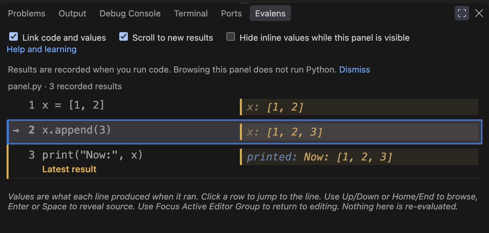
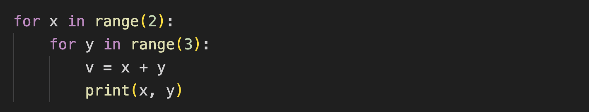
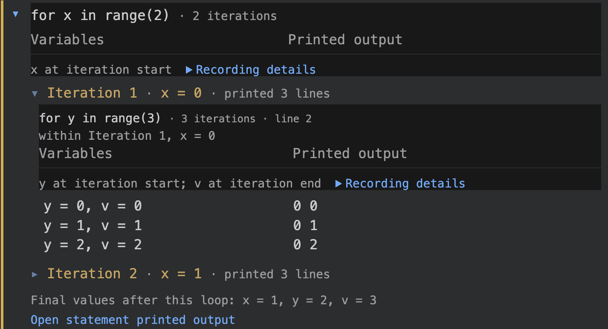
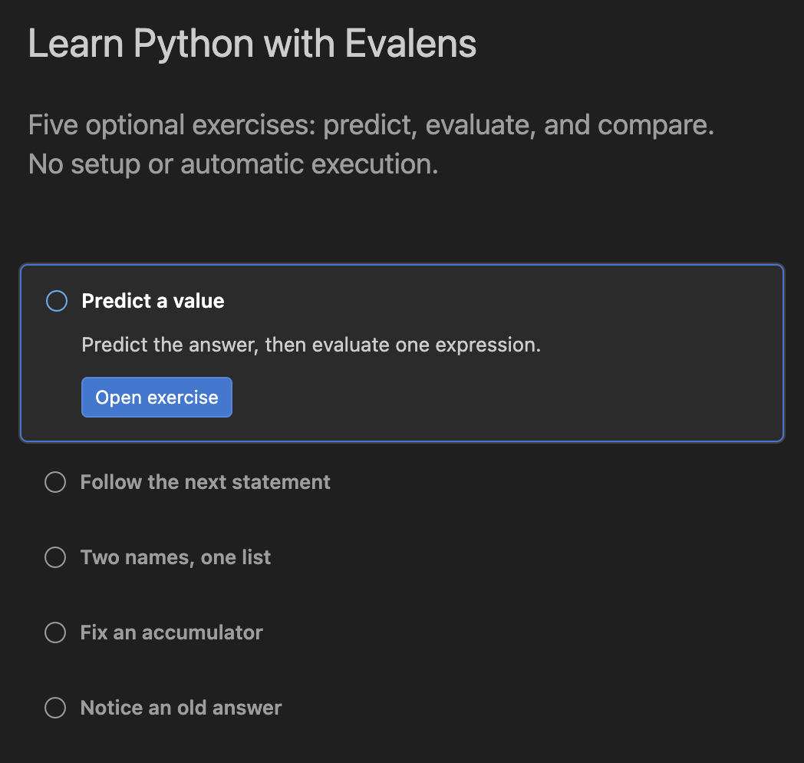

<p align="center">
  
</p>

<h1 align="center">eval·lens</h1>

<p align="center">
  <em><b>eval</b>uate your Python, through a <b>lens</b>.</em><br>
  <sub>Evalens is a VS Code extension.</sub>
</p>

<p align="center">
  <b>A notebook's feedback loop, inside an ordinary <code>.py</code> file.</b><br>
  Run a line when you choose. See its answer where you wrote it.
</p>

Put the cursor on a line. Press **`Cmd+Enter`** (`Ctrl+Enter` on Windows/Linux).
The answer appears beside the code, and stays there as you move on.


**The fourth line is the surprise.** You changed `b`, yet `a` now contains
`3` too. Both names refer to the same list.

Earlier readings stay beside their statements: `a = [1, 2]` still shows
`[1, 2]`, while the final `a` shows `[1, 2, 3]`. You can see what changed,
and where. Four lines make an abstract idea concrete.

## Who it's for

For students and anyone learning Python, Evalens makes it easier to connect
the code you write with the values it produces. Predict an answer, run a
statement, and compare. Teachers and mentors can use the same view to explain
a tricky idea.

As you gain experience, use it to try expressions, inspect data, and explore
unfamiliar code. Keep the debugger for breakpoints and stepping through
function calls.

## A total that keeps starting over

Suppose you want to add `2`, `4`, and `6`. You expect `12`, but this program
gives `6`.


Look at `total` beside the loop: `2, 4, 6`. Each time around,
`total = n` replaces the previous total with the next number. The earlier
numbers are forgotten.

Change the line inside the loop to:

```python
total = total + n
```

Read that as: take the total so far, add the next number, and store the new
total. Evaluate the whole file again with **`Cmd+Alt+Enter`**
(`Ctrl+Alt+Enter` on Windows/Linux), starting again from `total = 0`.
Its history becomes `2, 6, 12`, and the final answer is `12`.
Python also lets you write this more briefly as `total += n`.
Keeping a running total like this is called *accumulating*; the recorded
values let you see it happen.

That is useful in your first Python course. It is still useful when you
know the language and are trying to understand someone else's code.

## Your first evaluation

You need **VS Code 1.90 or later** and **Python 3.9 or later**. Evalens can
use the interpreter selected in the Python extension, or find `python3` /
`python` on your `PATH`. No additional Python packages are required.

Install [Evalens from the VS Code Marketplace](https://marketplace.visualstudio.com/items?itemName=mbjarland.evalens),
published by **mbjarland**, or run:

```sh
code --install-extension mbjarland.evalens
```

Open a Python file and try the four-line example:

```python
a = [1, 2]
b = a
b.append(3)
a
```

Start on the first line. Press **`Cmd+Shift+Enter`**
(`Ctrl+Shift+Enter` on Windows/Linux) to evaluate and move to the next
statement. Before each press, predict what will appear.

With focus in the Python editor:

| macOS | Windows / Linux | Action |
|---|---|---|
| `Cmd+Enter` or `Alt+Enter` | `Ctrl+Enter` or `Alt+Enter` | Evaluate the statement at the cursor |
| `Cmd+Shift+Enter` | `Ctrl+Shift+Enter` | Evaluate and Advance |
| `Cmd+Alt+Enter` | `Ctrl+Alt+Enter` | Evaluate File (or selection); resets variables for a whole file by default |
| `Escape` | `Escape` | Clear recorded results; keep Python variables |

Nothing runs as you type. Evaluation runs a complete enclosing statement:
placing the cursor inside a loop runs that loop. Your file stays ordinary
Python, with no cell markers or saved outputs added to it.

Every command is also in the Command Palette: **`Cmd+Shift+P`**
(`Ctrl+Shift+P` on Windows/Linux), then type **Evalens**. If a shortcut does
nothing, try the command there and use **Evalens: Fix Keybinding Conflict**.
See the [installation](docs/user-guide.md#install) and
[keybinding guide](docs/user-guide.md#keybindings) for other setups.

## When the answer needs more room

Hover for a longer value or an error's traceback. For larger results, open
**Evalens: Show Values Panel**: the source sits beside its recorded values
and `printed:` output. Move between code and results and the matching row
follows. **Latest result** marks what just finished, even after Evaluate and
Advance moves on.



Fold a tall result back to the height of its code. Open a large recording in
an editor tab to find, select, and copy the part you need. Browsing results
does not run the program again.

## A loop tells you what happened

Each pass through the outer loop sets `base` to ten times `x` and prints it.
The inner loop adds each `y` to `base`, stores the result in `v`, and prints
the pair `x, y`:



<details>
<summary>Copy this example</summary>

```python
for x in range(2):
    base = x * 10
    print("base:", base)
    for y in range(3):
        v = base + y
        print(x, y)
```

</details>

Each loop keeps its own value history beside its `for` header. Here in the
panel, **Iteration 1** is folded and **Iteration 2** is open: `x` is `1`,
`base` is `10`, and the inner loop records `v` as `10, 11, 12`. The short
guide leads to that inner loop. **Variables** and **Printed output** share
one pair of headings, so you can follow both down the page.



Short loops stay compact. Longer histories and output fold or page, with
the same navigation at each level. If details were not saved, the panel
says so. **About these values** explains when the values were read; the
[loop guide](docs/user-guide.md#loops-keep-values-beside-the-output-they-produced)
covers capture limits and missing readings.

## Room to grow

For a place to start, choose **Evalens: Open Learning Walkthrough**, or
**Try a guided example** in the empty Values panel. Five editable exercises
invite you to predict a value, follow successive statements, explore aliasing,
fix an accumulator, and recognize a stale result. Opening one never runs it.



Keep the guides nearby while you need them. Dismiss the introduction when
you know your way around; **Help and learning** brings it back. The same
tool is ready for inspecting an unfamiliar data structure, trying a
comprehension, or adding an expression watch inside a loop. There is no
beginner mode to outgrow.

When the question needs a breakpoint, a function call followed step by step,
or a look at the call stack, use the
[Python debugger](https://code.visualstudio.com/docs/python/debugging).
Evalens runs statements and keeps their answers; the debugger lets you pause
inside an execution. Both earn their place.

## What stays, what resets

Each result records **what that statement produced when it ran**. It does
not promise that Python still holds that value. Stale markers flag edits and
some dependency changes; alias mutations are not fully tracked. Evaluate
again when you want a fresh reading.

Statement evaluations share a Python session. **Clear Inline Results** clears
the display and keeps variables. **Restart Kernel** discards variables and
saved input answers, while earlier recordings remain visible. **Evaluate
File** resets variables by default. A debugger starts its own execution.
The [session guide](docs/user-guide.md#commands) explains the choices.

## Reference and support

[User guide](docs/user-guide.md) · [Commands](docs/user-guide.md#commands) ·
[Settings and colors](docs/user-guide.md#settings) ·
[Release notes](CHANGELOG.md) · [Report an issue](https://github.com/mbjarland/evalens/issues)

MIT licensed. See [LICENSE](LICENSE). The inline rendering approach builds on
[Calva](https://github.com/BetterThanTomorrow/calva).
