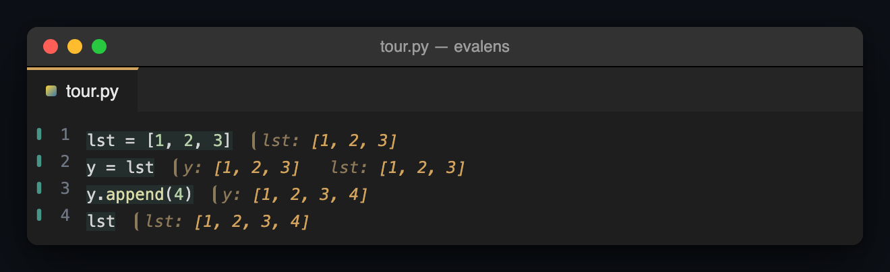

# Evalens — Inline Python Values

Put the cursor on a line, press a key, and see what that line produced,
painted beside the code. No `print()`, no debugger, no notebook.

## Demo

<p align="center">
  
</p>

*This is a rendered stand-in, not a screen recording — see below.* The
picture is `examples/tour.py`'s aliasing example (the block `IDEA.md` opens
with), painted after four presses of **Evaluate and Advance**. The text on
it is genuine: it was produced by actually driving `kernel/evalens_kernel.py`
through the same path the extension uses to paint a line
(`render/present.ts`, `render/format.ts`), not by typing what the extension
is supposed to say — `src/test/integration.test.ts` asserts the same four
strings against the running kernel. What is not genuine yet is the
*animation*. A GIF is the goal — `IDEA.md` argues, correctly, that one above
the fold outsells the name — and recording it needs a human driving a real
editor in front of a screen capture, which nothing writing this README can
do on its own. [`docs/development/demo-shooting-script.md`](docs/development/demo-shooting-script.md)
is the exact recipe waiting for that recording: the file, the four lines,
the keystrokes, and the target length.

> **The notebook feedback loop, on a file that never stops being source
> code, with the state visible instead of hidden.**

A VS Code extension: a TypeScript front end and a small Python kernel that
holds a namespace between evaluations, so what you evaluate next sees what
you evaluated last. **Evaluation is explicitly triggered and never
continuous** — nothing in your buffer runs until you ask for it. That is a
deliberate choice, not a missing feature: beginner code is full of `input()`
prompts and infinite loops, and an evaluate-as-you-type mode relaunches a
program blocked on stdin every time typing pauses. See
[`IDEA.md`](IDEA.md) for the rest of the design and why each part of it is
the way it is.

**This category is not empty, and this README says so rather than pretend
otherwise.** `python.REPL.enableREPLSmartSend` (shipped in `ms-python.python`,
on by default) sends the statement under your cursor to a persistent REPL —
most of what this does, minus the answer staying in the file. VS Code's own
`debug.inlineValues` (also on by default) paints variable values inline
while a debug session is paused at a breakpoint — real inline values,
first-party, no extension required. What neither does is show what *each
line* produced, in file order, beside the code, without a terminal or a
paused debugger. `IDEA.md` names exactly which parts of this are already
covered by Microsoft and which are not, at the length the question
deserves.

## Requirements

**Python 3.9 or later on your `PATH`. That is the whole requirement.** No
Jupyter, no notebook server, no kernel to install, no launch configuration,
no marketplace account — which is most of the reason to reach for this rather
than the alternatives. Evalens uses the interpreter the Python extension has
selected if you have that extension, then `python3`, then `python`, and takes
the first that runs and reports 3.9 or later. Naming one in the
`evalens.pythonPath` setting overrides all of it.

## Install

There is no marketplace listing yet. Two ways to get the extension onto a
machine, most-assumed first.

**If someone handed you a `.vsix` file** — the path for a machine that has
nothing else set up, a first-year student's laptop being the motivating
case. You need VS Code and Python (see Requirements above) and nothing
beyond them.

1. Get `python-inline-values-<version>.vsix` however it reaches you — a
   shared file, a USB stick, a link to a GitHub Release.
2. In VS Code, open the Extensions view (`Cmd+Shift+X` / `Ctrl+Shift+X`),
   open its `···` menu, and choose **Install from VSIX...**, then pick the
   file. From a terminal instead:
   ```bash
   code --install-extension python-inline-values-0.0.1.vsix
   ```
3. Reload the window when VS Code asks, open a Python file, and press
   `Alt+Enter` on a line. If nothing happens, read the keybinding section
   below before anything else — a dead key is the expected symptom of a
   conflict, not of a broken install.

**Building the `.vsix` yourself** — for anyone who already has Node and
wants the current branch rather than a shared file:

```bash
npm ci
npm run package
code --install-extension python-inline-values-0.0.1.vsix
```

`npm run package` writes `python-inline-values-<version>.vsix` into the
repository root; the version comes from `package.json`. The rest is step 3
above.

## Commands

**Every command is in the Command Palette** (`Cmd+Shift+P` / `Ctrl+Shift+P`),
prefixed with `Evalens:`. That matters more here than it usually does — see
the keybinding conflict below — because a stolen key then never leaves you
without a way to run these.

| Command | What it does |
|---|---|
| Evalens: Evaluate at Cursor | Evaluates the form the cursor is in and paints its value beside it |
| Evalens: Evaluate and Advance | The same, then moves to the next top-level statement — hold the key to walk a file |
| Evalens: Evaluate File | Runs the file top to bottom, annotating each statement — or the selected statements, when there is a selection |
| Evalens: Run File as Script | Runs the whole file the way `python3 file.py` would, so an `if __name__ == "__main__":` block runs |
| Evalens: Evaluate Above Cursor | Resets the namespace and runs everything above the statement the cursor is in, stopping at the first failure |
| Evalens: Clear Inline Results | Removes the annotations from the active editor |
| Evalens: Announce Result at Cursor | Puts what is painted on the cursor's line into a notification, where a screen reader reads it |
| Evalens: Interrupt Evaluation | Stops a running evaluation and keeps the namespace it built |
| Evalens: Restart Kernel | Throws away the namespace and starts a fresh interpreter |
| Evalens: Clear Input Answers | Forgets every replayed `input()` answer, keeping the namespace |
| Evalens: Show Output | Opens the Evalens output channel without taking the cursor out of the editor |
| Evalens: Fix Keybinding Conflict | Hands you the user keybinding described below |

**Evaluate File runs a selection, and runs whole statements.** Select the
first twenty lines and press the key: those statements run, in order,
annotated exactly as a full load annotates them. A selection that begins or
ends halfway through a statement runs that statement whole and briefly
highlights how far it reached — a partial statement is never executed, because
a fragment can parse into something valid that means something else. A
selection with no complete statement in it — a comment, a blank line — says so
in the status bar and runs nothing.

**Evaluate File never runs an `if __name__ == "__main__":` block, on
purpose.** Loading a file means *import this module*, which is what an
imported module's `__name__` genuinely is — the file's own name, not
`"__main__"` — so the guard is False and its body does not run, for the same
reason it would not run under a real `import`. That used to be silent: the
guard's own annotation showed nothing but the module name, which only reads as
"this is why" if you already know the idiom. It now says so directly —
`if __name__ == "__main__": => False -- not run as a script (Evalens: Run
File as Script)` — because a block that did not run must never look like one
that did.

**Evalens: Run File as Script is the separate, deliberate command that runs
it.** `__name__` is `"__main__"` for that one run and nothing else about the
file changes: it still runs top to bottom, into the same session, and the
namespace is not reset first — running it twice, or running it right after an
ordinary load, simply runs the file again on top of whatever was already
there, exactly as pressing Evaluate File twice does. `sys.argv` is
`[the file's path]` for the run, matching what `python3 file.py` gives the
script. There is no default keybinding, deliberately: reaching for this command
is meant to be a choice, and it is always one press away in the Command
Palette.

**A file that is part of a real package resolves its relative imports on an
ordinary load, and loses that on a script run — on purpose, and matching a
real interpreter both ways.** Opening `demo_pkg/__init__.py` and pressing
Evaluate File runs `from .geometry import area` the way `import demo_pkg`
would, because a load's whole premise is *import this module*: Evalens works
out the package it belongs to and gives it the `sys.path` entry and
`__package__` a real import would. Run File as Script answers the same file
differently, because `python3 demo_pkg/__init__.py` does: running a file
directly never establishes package context, in a terminal or in Evalens, so
the same relative import fails there with the same `ImportError` it would at
a command line. Neither answer is a bug in the other's terms — they are two
different real commands, faithfully imitated.

Running as a script has one real limit worth knowing before you rely on it:
`multiprocessing.Pool` and `concurrent.futures.ProcessPoolExecutor` send a
worker a *reference* to the function to call, by looking it up on
`sys.modules["__main__"]` — the interpreter's real, singular main module,
which stays the Evalens kernel process throughout. A function your file
defines lives in the kernel's namespace instead, so a worker cannot find it and
the call fails with `PicklingError: ... not found as __main__.<name>`, exactly
as it would if the same function were defined in a Jupyter cell or a live
REPL. Threads, `asyncio`, and everything else the guard is written to protect
run exactly as `python3 file.py` would; only the process-pool case cannot.

**Evalens: Evaluate Above Cursor gets a specific line ready to evaluate,
without evaluating it.** Put the cursor on line 40 and press it: everything
strictly above the statement the cursor is in runs, in order, annotated as
it goes — and the statement the cursor is actually in never runs here, on
purpose, because that is what Evaluate at Cursor is for. A cursor inside a
multi-line statement is not a special case: whichever line of it the cursor
is on, the whole statement is the boundary and stays unrun, since a
statement never runs partway.

It resets the namespace first, unconditionally, with no setting to turn
that off. A partial run's only honest promise is that the namespace
afterward matches what running the file from the top through the cursor
would have produced, and a binding left over from an earlier keypress would
quietly break that promise. Unlike Evaluate File, which keeps going after a
broken line because a file being explored in is expected to have one,
Evaluate Above Cursor stops at the first failure and reports which
statement it was — a namespace built on top of a failure it did not stop
for is one nobody can reason about.

## Keybindings

| macOS | Windows / Linux | Command |
|---|---|---|
| `Alt+Enter` | `Alt+Enter` | Evalens: Evaluate at Cursor — the top-level form |
| `Cmd+Enter` | `Ctrl+Enter` | Evalens: Evaluate at Cursor — the same command |
| `Cmd+Shift+Enter` | `Ctrl+Shift+Enter` | Evalens: Evaluate and Advance |
| `Cmd+Alt+Enter` | `Ctrl+Alt+Enter` | Evalens: Evaluate File |
| `Escape` | `Escape` | Evalens: Clear Inline Results |

**`Alt+Enter` is the top-level-form key.** Evaluate at Cursor resolves the
*enclosing top-level statement* — not the sub-expression under the cursor —
and `Alt+Enter` is the key Calva puts the top-level form on, in
`betterthantomorrow.calva`'s own manifest. So it is not a second-choice
binding or a workaround for the conflict below; it is what the command's
semantics already said the key should be. It is also the same chord on every
platform, and nothing in VS Code itself claims it in a Python file with the
find widget closed. When a command for the inner form lands it takes
`Ctrl+Enter`, and none of this changes.

**Both keys are contested, and with AREPL installed either may do nothing at
all.** `almenon.arepl` binds *two* keys under exactly the condition Evalens
uses, `editorTextFocus && editorLangId == python`:
`extension.executeAREPLBlock` on `Ctrl/Cmd+Enter`, and `extension.printDir`
on `Alt+Enter`. VS Code breaks a tie between two *extension* keybindings by
load order — the last one registered wins — and nothing makes load order
deterministic, so which extension answers can change between reloads. It
presents as a dead key: no error, no notification, no log line.

The Jupyter extension overlaps too, in both places, but only inside a file
that has `# %%` cells (`jupyter.hascodecells`). `ms-toolsai.jupyter` puts
`jupyter.runcurrentcell` on `Ctrl+Enter` — that one ships no `mac` override
and `ctrl` stays `ctrl` on macOS, so there it never meets `Cmd+Enter` — and
`jupyter.runcurrentcellandaddbelow` on `Alt+Enter`, which ships no override
either. That second absence reads the opposite way: `key` is the
cross-platform default, so a binding with no `mac` entry applies on macOS
rather than being missing there.

**The fix is a user keybinding.** User keybindings are resolved after every
extension's, so the last match on a key is always yours — this is the only way
to settle the tie deterministically, and it is why Evalens cannot fix it from
its own manifest. Run **Evalens: Fix Keybinding Conflict**: it copies the
entry below and opens your `keybindings.json` so you can paste it. Nothing is
written to your settings on your behalf, and deleting the entry undoes it.

```jsonc
  // Evalens: a user keybinding is resolved after every extension's,
  // so this one wins the key whichever extension loaded last.
  {
    "key": "cmd+enter",
    "command": "evalens.evaluateAtCursor",
    "when": "editorTextFocus && editorLangId == python && !findWidgetVisible"
  },
  // The same command on the top-level-form key, which is where
  // Calva puts it. Uncontested by VS Code itself; not by AREPL.
  {
    "key": "alt+enter",
    "command": "evalens.evaluateAtCursor",
    "when": "editorTextFocus && editorLangId == python && !findWidgetVisible"
  },
  // Removes AREPL's extension.executeAREPLBlock from cmd+enter. Delete this
  // entry to keep it -- the one above already wins where both apply.
  {
    "key": "cmd+enter",
    "command": "-extension.executeAREPLBlock",
    "when": "editorTextFocus && editorLangId == python"
  },
  // Removes AREPL's extension.printDir from alt+enter. Delete this
  // entry to keep it -- the one above already wins where both apply.
  {
    "key": "alt+enter",
    "command": "-extension.printDir",
    "when": "editorTextFocus && editorLangId == python"
  }
```

Use `ctrl+enter` in place of `cmd+enter` on Windows and Linux; `alt+enter` is
the same on every platform. The removal entries are not redundant: an Evalens
binding only wins where its `when` holds, so without them AREPL still answers
while the find widget is open.

**Installing Evalens is what makes that entry matter.** While the extension
only ever ran in an Extension Development Host, a user keybinding scoped with
`isDevelopment` was enough — it applied in the dev host, which was the only
window Evalens existed in. An installed extension exists in ordinary windows
instead, where `isDevelopment` is false, so a binding carrying that clause now
excludes exactly the windows the extension runs in: AREPL wins `Cmd+Enter`
back and the key goes dead again, silently, for a reason that reads like a bad
install. The entries above are unscoped on purpose; if you wrote one against
the dev host, drop the `isDevelopment` clause.

**On a machine with Evalens installed, the answer is not to install AREPL.**
The two bind the same two keys to the same job, and which one answers is
decided by extension load order, which nothing makes stable. There is no
configuration that makes both work on one key. Keep the one you use.

Evalens says all of this itself. When it activates and finds AREPL enabled it
writes the conflict and the snippet to its **Evalens** output channel every
time, and offers the fix in a notification once — once per installation, never
again, whatever you answer. If you dismissed it, **Evalens: Fix Keybinding
Conflict** in the palette hands you the same thing at any time.

The default is staying on `Ctrl/Cmd+Enter` as well. It is what Calva uses,
what AREPL uses, and what this audience's fingers already know; ceding it to
dodge the collision would trade a solvable conflict for a permanently worse
default. Adding `Alt+Enter` is not ceding it — it is binding the key the
top-level semantics always implied, and both keys run the same command until
the inner-form command exists to take `Ctrl+Enter` back.

### The advance key, and why it is not `Shift+Enter`

**Evaluate and Advance is on `Cmd+Shift+Enter` / `Ctrl+Shift+Enter`, and
`Shift+Enter` is deliberately not used.** `Shift+Enter` is what the convention
wants — it is run-and-advance in Jupyter, Spyder, MATLAB and VS Code's own
Interactive Window — and in a Python file it is claimed four times over, by
`python.execSelectionInTerminal`, `python.execInREPL`,
`jupyter.execSelectionInteractive` and `jupyter.runcurrentcelladvance`. Taking
it would reproduce the AREPL defect above exactly, and against extensions even
more widely installed. A key that dies on load order is worse than a key
nobody's fingers know yet.

`Cmd+Shift+Enter` is claimed by no extension of the sixty-one measured. VS
Code holds it as a core default for `editor.action.insertLineBefore`, which an
extension binding outranks — a core default is not a tie.

**`Ctrl+Shift+Enter` is contested, so Windows and Linux need the same fix
AREPL needs.** `ms-toolsai.jupyter` binds `jupyter.runAndDebugCell` there with
**no `when` clause at all**, so unlike its two bindings above it is not gated
on `# %%` cells: it matches unconditionally, in any editor, in any file. The
user keybinding that wins:

```jsonc
  {
    "key": "ctrl+shift+enter",
    "command": "evalens.evaluateAndAdvance",
    "when": "editorTextFocus && editorLangId == python && !findWidgetVisible"
  },
  {
    "key": "ctrl+shift+enter",
    "command": "-jupyter.runAndDebugCell"
  }
```

The removal carries no `when` because the binding it cancels carries none;
a removal only cancels a binding it matches exactly. On macOS neither entry is
needed — `Cmd+Shift+Enter` is ours uncontested — and **Evalens: Evaluate and
Advance** is in the palette on every platform regardless.

## What print() shows

Printed output goes on the line, next to the code that printed it:

```python
print("hello")                    printed: hello
x = compute()                     x: 42   printed: warming up …(3 lines)
```

`printed:` is a label in the same `name: value` grammar as `x: [1, 2, 3]`, so
there is nothing new to read. One line of output *is* the annotation — the
`None` that `print` returns is suppressed, the way a `None` gives way to
anything better on the line — and several lines show the first with a count of
the rest. The whole text is on the hover, along with the link that opens the
**Evalens** output channel; the channel is also where output appears live
while a long loop is still running.

Set `evalens.printedLabel` to `»` if you want the marker terse instead of
spelled out. `stderr:` keeps its own name, and is deliberately **not** painted
in the error colour: a library writing a warning has not failed.

The channel never opens itself and never takes the cursor. Output belongs
beside the code that produced it; a panel would put the answer somewhere other
than the code, which is the problem this extension exists to solve.

## Answering input()

A file with `input()` in it prompts the first time a statement reaches it.
Every evaluation after that reuses the same answers automatically, so
iterating on the twenty lines below a prompt does not mean retyping it twenty
times. The stored answers are the running kernel's, keyed to the statement
that asked rather than to its line number, so inserting a line above a prompt
never shifts a saved answer onto the wrong one; editing the statement itself
starts it asking again. **Evalens: Clear Input Answers** forgets everything
stored without touching the namespace, and restarting the kernel forgets it
too.

For an answer you never want to type, or one that should travel with the
file, write it in a comment instead:

```python
name = input("Your name: ")   # evalens: Ada
age  = int(input("Age? "))    # evalens: 34
```

The comment is never evaluated — the text after `evalens:` is taken literally,
so it is exactly as inert as any other comment even if it looks like code —
and it wins over a stored answer whenever both exist. `a, b = input(),
input()` reads a comma-separated list in order: `# evalens: Ada, 34` answers
the first read with `Ada` and the second with `34`. The value is always a
string, the same as `input()` itself always returns one, so `# evalens: 34`
gives `int(input(...))` a real `"34"` to convert rather than a number it never
had to.

Because the comment is ordinary Python, `python file.py` runs the file
exactly as written and still asks a person for real.

## The marker in the gutter

An annotation is a record of what a statement produced *when it ran*. Nothing
re-reads it, and nothing re-runs your code to keep it current — so editing a
line leaves a value that was true a moment ago sitting beside code that no
longer produces it. That is the notebook's oldest failure, and the marker in
the gutter is what keeps it visible here.

| Marker | Means |
|---|---|
| Unbroken bar | Evaluated. The kernel holds what this line says |
| Broken bar | Stale. The line has been edited since it ran; the value is out of sync with what the kernel has, not necessarily wrong |
| Bar and dot | The evaluation raised, and the message is the annotation |

**Only evaluating the statement again clears a stale marker.** Undo does not,
and that is deliberate: putting the text back does not put the value back,
because the kernel was never told anything. Whitespace-only edits — a
reindent, a formatter on save, a trailing space — do not mark anything, and an
edit that adds or removes lines inside a statement removes its annotation
outright, because there is then no statement for the value to sit beside.

**A value also goes stale when something it was computed from changes.**

```python
x = 1        x: 1
y = x + 1    y: 2
```

Edit the first line and re-run it, and the second is out of date without its
own text having changed at all. So Evalens marks it: re-evaluating a statement
marks every annotation *below it in the file* that reads a name it just bound.

**Nothing is ever re-run to resolve any of this.** Evalens marks and stops —
it is not a reactive notebook, and it does not decide when your code executes.
The consequence worth knowing is that the analysis is a parse, not a trace: it
reads the names each statement writes and consults, so it cannot see a value
change through an alias — `y = lst` followed by `lst.append(4)` leaves `y`
looking current. Marking that too would mean running your code to find out,
which is the one thing this extension does not do behind your back.

## Screen readers

An inline result is a text decoration, and **the VS Code API gives a
decoration no accessibility label of any kind** — no `label`, no `role`,
nothing. `AccessibilityInformation` exists and is accepted by status bar
items, tree items and notebook cell status items; it is accepted by no
decoration type. So without a second channel, pressing the evaluate key
produces silence that sounds exactly like a dead keybinding.

Evalens adds that second channel. **The annotation is unchanged** — the answer
still goes on the line, and this is an addition for readers the line cannot
reach rather than a panel that moves it.

- **Evalens: Announce Result at Cursor** reads out what is painted on the
  cursor's line, whenever you ask for it. It needs no setting, it says
  `no result on this line` when there is nothing there, and it says `stale,
  edited since it ran` when the value no longer describes the code beside it —
  the caveat the gutter marker carries in a picture.
- **`evalens.announceResults`** makes that automatic for `Evaluate at Cursor`
  and `Evaluate and Advance`: each result is put into a notification, which VS
  Code raises an aria alert for, and the last one is kept in the status bar
  with an accessibility label on it. Set it to `always` to turn it on. It is
  on already if `editor.accessibilitySupport` is set to `on`, which is what VS
  Code's own accessibility documentation tells you to set when its detection
  does not find your screen reader.
- **A file load never announces.** Two hundred annotations from one keypress
  would be worse than announcing nothing.

Three limits are worth knowing before you rely on this.

**Notifications filtered to Do Not Disturb are not announced.** VS Code marks
them silent and skips the alert, so the announced channel goes quiet with
them.

**Announced results accumulate in the notification centre.** Each toast
dismisses itself after a few seconds, but the bell keeps a copy. Nothing about
`always` is free; it is the only surface VS Code announces from, and this is
what it costs.

**The status-bar summaries are silent.** `Evaluate File` reports what it
loaded through `setStatusBarMessage`, and that is backed by a shared status bar
item with no accessibility label — the status bar footer is rendered
`aria-live="off"`, so nothing there is announced when it changes. Reach the
last announced result with `workbench.action.focusStatusBar` and arrow onto
the Evalens entry; the load summary itself is not reachable at all yet.

Spoken text is not the painted text with the glyphs left in. `=>` is
punctuation a screen reader skips or spells out, a colon is silent, and the
three non-breaking spaces that separate two values on a line are heard as one
pause — so the announced form says `lst is [1, 2, 3]. x is 5`, leads a failure
with the word `error` because the colour carrying that distinction is
invisible, and stops after about three hundred characters rather than reading
out an eight-thousand-character list.

The command has **no default keybinding**. Every chord worth having in a
Python file is already claimed by something (see above), and picking one
without checking what owns it is how this project shipped a dead `Cmd+Enter`.
Bind it yourself:

```json
{
  "key": "ctrl+alt+a",
  "command": "evalens.announceResultAtCursor",
  "when": "editorTextFocus && editorLangId == python"
}
```

**None of this has been tested with a screen reader.** The wording, the
truncation and the caveats are covered by unit tests, and that VS Code fires
an aria alert for every notification was read out of its source — but nobody
on this project has turned VoiceOver, NVDA or JAWS on and listened to the
result.

## Settings

All of these are under **Settings → Extensions → Evalens**, where each
description says what the option *costs* rather than what it is called.

| Setting | Default | What it buys, and what it costs |
|---|---|---|
| `evalens.pythonPath` | `""` | The interpreter to run the kernel with. Empty tries the Python extension's choice, then `python3`, then `python`. A path set here is never quietly replaced — if it does not work, Evalens says so instead of falling back |
| `evalens.progressDelay` | `750` | Milliseconds before a still-running evaluation earns a cancellable notification. Higher is a quieter window, at the cost of a longer silence before anything confirms the keypress and before there is a Cancel button |
| `evalens.resultColumn` | `0` | Column to line results up on. `0` follows the code, so nothing is pushed further right than it has to be. A fixed column tidies a file of plain assignments and wastes width after every short line |
| `evalens.loopValues` | `true` | Whether a `for` loop reports every value its target held or only the last. **Off is how you silence loop sequences**, and it stops the loop being instrumented rather than just hiding the result |
| `evalens.loopIterations` | `5` | Iterations listed before the rest are elided. More shows the shape of a run more clearly, at the cost of an annotation that pushes code off the right of the window |
| `evalens.readNames` | `true` | Whether the names a line merely reads are annotated. **Off is how you silence those**, at the cost of having nothing to say on any line that is not a binding — most lines in a real file |
| `evalens.readNamesPerLine` | `4` | Names annotated per line. More names, at the cost of a longer annotation on busy lines; the ones dropped are the ones furthest right |
| `evalens.printedLabel` | `"printed"` | What the annotation calls the output a statement printed. The word keeps the `label: value` grammar the rest of the line uses; `»` is the terse marker, and the one that survives every font VS Code falls back to |
| `evalens.advanceSkipsComments` | `true` | Whether Evaluate and Advance steps over comment lines. Off, it stops once per comment block — one more press each, and that press evaluates nothing |
| `evalens.announceResults` | `"auto"` | Whether a result is announced as well as painted, for a screen reader. `auto` follows `editor.accessibilitySupport`; `always` announces every one; `never` announces none. See above |

Two of them are off switches on purpose. Loop sequences and read-name
annotations are the two things Evalens adds that a reader might not want, and
uninstalling is not an adjustment. Turning either off stops the work as well
as the display: an uninstrumented loop costs nothing per iteration.

Setting names are one shape: `evalens.` followed by a camelCase noun phrase
naming the thing configured, subject first, so the alphabetical settings list
keeps `loopIterations` beside `loopValues`. `alignColumn` was the odd one out
and is now `resultColumn`.

### What is deliberately not a setting

Everything here was considered and declined. Each is a constant in the source
with the reason written beside it, so the next person can argue with the
reason rather than guess whether anyone thought about it.

There is deliberately **no setting for the keybindings**. VS Code rebinds keys
natively and does it better than a setting could — a user keybinding is the
only thing that wins the load-order tie described above, and an
`evalens.keybinding` would lose it exactly as the manifest does.

Nothing hides **printed output**. `evalens.printedLabel` renames it and no
setting suppresses it, because the output is the statement's own doing: hiding
it would hide what your code did rather than what Evalens added. The two off
switches above exist precisely because loop sequences and read names are the
opposite — things Evalens says on a line that you did not ask it to say.

Nothing hides the **`(partial: line 19)` caveat** a value carries when the rest
of the file did not parse. An annotation without it claims to have been
computed with the whole file, and a value that asserts more than we know is
the defect this project exists to stop.

**Evaluate and Advance** stops at the last statement rather than wrapping to
the top, and centres its destination only when that destination is off screen.
Wrapping would re-run every side effect in a file somebody has just finished
walking; the reveal alternatives either scroll on every press or land the next
statement on the bottom edge with none of its code visible.

The numbers left over are transport guards and runaway guards rather than
taste — how large a value may be on the wire, how long a prompt may be, how
many annotations one file load may paint. A cap the far end is allowed to
raise is a suggestion rather than a guard, and someone who hits the annotation
limit does not want a bigger number: they want to know their first import
failed.

### Colours

Every colour Evalens paints is a contributed theme colour, which means all of
them are already overridable in `settings.json` — per theme, if you like —
without the extension offering a setting of its own:

```jsonc
"workbench.colorCustomizations": {
  "evalens.resultForeground": "#d1a35c",
  "evalens.resultBackground": "#00000000",
  "evalens.labelForeground": "#8d7a5a",
  "evalens.outputLabelForeground": "#5c7fa6",
  "evalens.errorForeground": "#f14c4c",
  "evalens.errorBackground": "#00000000",
  "evalens.evaluatedRegionBackground": "#4a9c8c22",
  "evalens.pendingForeground": "#8c8c8c",
  "evalens.pendingRegionBackground": "#8c8c8c26",
<<<<<<< HEAD
  "evalens.flashRegionBackground": "#4a9c8c66",
  "evalens.annotationBorder": "#e0a3ff",
  "evalens.annotationTint": "#d1a35c1a"
=======
  "evalens.askingForeground": "#e8963c",
  "evalens.askingRegionBackground": "#e8963c66",
  "evalens.flashRegionBackground": "#4a9c8c66"
>>>>>>> f71414c (Paint a blocked prompt as the opposite of a slow statement)
}
```

Those are the dark-theme defaults, so the block above changes nothing until
you edit it. If you dislike the gold, the first line is the whole fix.
`resultBackground` and `errorBackground` are contributed but not currently
painted anywhere: #95 moved every state's background onto the shared
`annotationTint` below, so setting either of the first two no longer changes
anything. They stay contributed rather than removed, so a customization
already made against them does not silently start failing.

`askingForeground` and `askingRegionBackground` are the one line on screen
that is blocked on `input()` rather than merely slow — orange rather than
grey because nothing moves until the reader answers, and never red, because a
prompt is not a failure.

An annotation is painted in three colours rather than one, because it carries
two kinds of thing. Values -- what the program produced, including the text
after `printed:` -- take `resultForeground`. The labels that introduce them --
`x:`, `y:`, the `=>` separator, the `…+N more` footnote -- take
`labelForeground`, a desaturated version of the same hue, so a name and its
value read as one unit. `printed:` and `stderr:` take
`outputLabelForeground`, which leaves that hue family entirely because output
is a different kind of thing from state. The two label colours sit at the same
luminance and differ only in hue, warm against cool: that is the axis both
common forms of colour blindness leave intact, so the two remain
distinguishable where a red-green split would collapse.

Two more things mark an annotation as a distinct surface, rather than a
second comment sitting next to one you typed. A faint `annotationTint` washes
behind each *chip* of it — a label and the value it introduces, or
`printed:` and its text — with the gap between two chips left untinted, so
the line still reads as several facts rather than one blur; a tint is what a
glyph cannot have, which is what makes each chip read as structure rather
than as a stray character. On the leading edge of the first chip, a 3px
`annotationBorder` bar, corners squared rather than rounded so it cannot be
mistaken for a parenthesis, with 8px of breathing room inside every chip's
own edges so the tint does not hug the text it introduces. The bar is a
saturated violet of its own rather than the dim `labelForeground`, which
exists to recede and would make it the quietest thing on the row; the tint
takes `resultForeground`'s own hue at low opacity, one shade for every
state, computed to stay clear of the contrast floors above. The bar takes on
the colour of whatever state the annotation is actually in:
`pendingForeground` while stale or still running, `errorForeground` on a
raised statement. A bare line with no annotation never gets either.

## License

MIT — see [`LICENSE`](LICENSE). The inline rendering approach is taken from
[Calva](https://github.com/BetterThanTomorrow/calva), which is MIT as well;
matching the licence is the plain form of the attribution
[`IDEA.md`](IDEA.md) records as intended.
