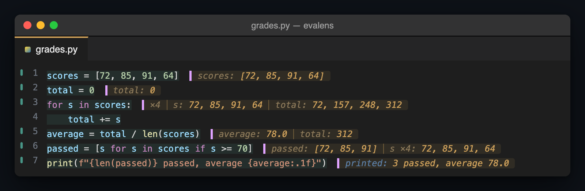
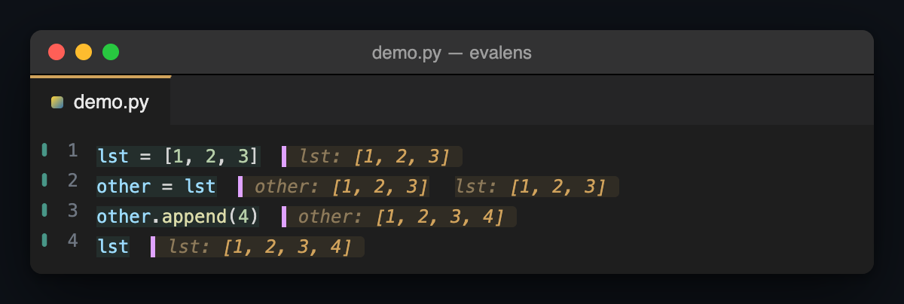
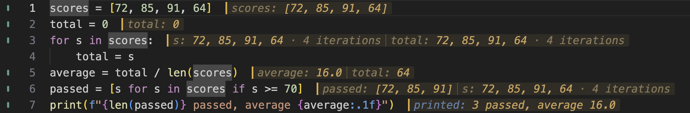
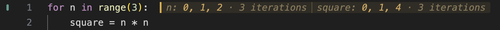
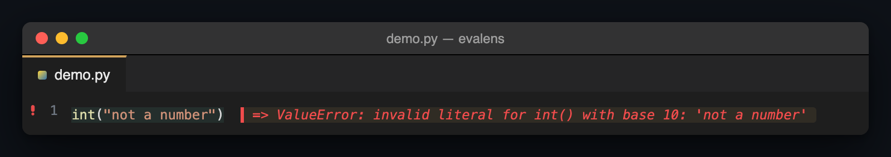
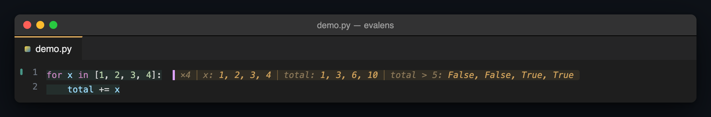

<p align="center">
  
</p>

<h1 align="center">eval·lens</h1>

<p align="center">
  <em><b>eval</b>uate your Python, through a <b>lens</b>.</em><br>
  <sub>Evalens is a VS Code extension.</sub>
</p>

<p align="center">
  <b>Live, line-by-line Python inside an ordinary <code>.py</code> file —
  a notebook's feedback loop, without the notebook.</b>
</p>

<p align="center">
  
</p>
<p align="center"><sub>That is <a href="examples/grades.py"><code>examples/grades.py</code></a>
after one press of Evaluate File — rendered from the real kernel and the
real renderer, not drawn by hand, but not yet a screen recording.
<a href="examples/demo.py"><code>examples/demo.py</code></a> is the file to
film and
<a href="docs/development/demo-shooting-script.md">the shooting script</a>
is the recipe.</sub></p>

Put the cursor on a line. Press `Cmd+Enter` (`Ctrl+Enter` on
Windows/Linux). The value appears beside the code — and stays there while
you press it on the next line, and the next.

<p align="center">
  
</p>

```python
lst = [1, 2, 3]
other = lst
other.append(4)
lst
```

Four lines, four answers, all on screen at once, in the order they sit in
the file. The fourth line is the lesson: `lst` changed, and `lst` was never
on the left of anything. A student who *sees* that has understood aliasing.
A student who is told it has been told something.

## A trace, not a current value

This is the idea the whole tool is built on, and it is worth one paragraph.

A debugger shows you the **current** value of a variable: stop the program
somewhere and look. That is one moment, and it is always the last one. Stop
after `other.append(4)` above and both names read `[1, 2, 3, 4]` — correct,
and useless, because the thing worth learning was that they *used to* be the
same object *before* anyone could tell.

Evalens shows you a **trace**: what each line produced **when it ran**,
kept beside the line, never re-read later. Line two still says
`other: [1, 2, 3]` after line three has changed it, because that is what
line two produced. You are looking at the history of the program, laid out
down the page in the same order you wrote it. That is the thing a terminal
scrolls away, a debugger collapses into "now", and a notebook only gives you
if you stop writing programs and start writing cells.

<p align="center">
  
</p>

**Here is the same program with one character missing** — `total = s` where
it should say `total += s`. Read line 3: `×4   s: 72, 85, 91, 64   total:
72, 85, 91, 64`. Both ran four times, so the count is said once, and once
it is said the two sequences sit close enough to compare by eye: `total`
mirrors `s` exactly. The accumulator never accumulates; it just takes each
score in turn. Two lines down, `average: 16.0` is the consequence. A
debugger stopped at the end would show you `total: 64` and nothing about
how it got there. The trace shows you the bug on the line that has it,
without a breakpoint, without a `print()`, without leaving the file.

## Who this is for

**Someone learning Python who has to write real programs.** Many first-year
courses forbid notebooks for exactly the reason they are seductive: a
notebook lets you run cells in any order, accumulate state nobody can see,
and never once produce a file that runs top to bottom. That habit does not
ship a Mars lander, a trading system, or a passing assignment. So the course
says *write `.py` files* — and takes the notebook's one genuine gift, the
tight see-what-happened loop, away with it.

Evalens gives that loop back **without giving back the notebook**:

- The file stays a plain `.py`. `python3 yourfile.py` runs it unchanged.
  There are no cell markers, no magic comments, nothing to strip out before
  you hand it in.
- Nothing runs until you ask. You press a key; one statement runs. No
  evaluate-as-you-type, which on beginner code means re-launching a program
  stuck at `input()` every time you pause.
- The state is *visible*. Every value is beside the line that made it, so
  "why is this 55?" is answered by reading upward, not by adding a
  `print()`.
- The only thing you install is Python. No Jupyter, no `ipykernel`, no
  interpreter picker, no `launch.json`.

Not allowed a notebook, or just not interested in one — either way the loop
is the point and the container never was. It is also for anyone who has ever
added `print(x)` on line 40 to find out what line 12 did, which is
everyone.

## Try it in sixty seconds

You need VS Code and **Python 3.9 or later on your `PATH`**. Nothing else.

```bash
code --install-extension evalens-0.0.1.vsix   # from a release or a friend
```

Open any `.py` file, put the cursor on a line, press **`Cmd+Enter`**
(`Ctrl+Enter` on Windows/Linux). Then hold **`Cmd+Shift+Enter`**
(`Ctrl+Shift+Enter` on Windows/Linux) and watch it walk down the file. Full
install options, including building from source, are under
[Install](#install) below.

For five optional hands-on exercises, choose **Evalens: Open Learning Walkthrough**
from the Command Palette. Predict values, step through code, explore list aliasing,
fix an accumulator, and see why an edited answer becomes stale. Each exercise opens
as an editable, unsaved Python document; nothing runs until you evaluate it.
**Evalens: Open Learning Exercise** opens an individual exercise. The walkthrough
is optional, and its checkboxes are yours to mark after trying each exercise.

## Learn it in four keys

Everything Evalens does starts from one of these.

| macOS | Windows / Linux | What happens |
| :--- | :--- | :--- |
| `Cmd+Enter` or `Alt+Enter` | `Ctrl+Enter` or `Alt+Enter` | Run the statement under the cursor. Its value appears beside it. |
| `Cmd+Shift+Enter` | `Ctrl+Shift+Enter` | The same, then move to the next statement — hold it to walk the file. |
| `Cmd+Alt+Enter` | `Ctrl+Alt+Enter` | Run the whole file from a clean namespace, top to bottom. |
| `Escape` | `Escape` | Clear every annotation in the editor. |

`Alt+Enter` also runs the statement under the cursor, as a spare in case
`Cmd+Enter` (`Ctrl+Enter` on Windows/Linux) is taken on your machine — if
it is, the tool tells you and offers to fix it.

**Everything else is in the Command Palette.** Press `Cmd+Shift+P`
(`Ctrl+Shift+P` on Windows/Linux) — or `F1`, which works on every
platform; type `Evalens`, and every command appears with its name in
front: *Run File as Script*, *Evaluate Above Cursor*, *Add Inline Watch*,
*Inspect Value*, *Interrupt Evaluation*, *Restart Kernel*. You never need
to remember more than the word.

**Your first two minutes.** Open any `.py` file. Put the cursor on the
first line and press `Cmd+Enter` (`Ctrl+Enter` on Windows/Linux) — the
value lands beside it. Press `Cmd+Shift+Enter` (`Ctrl+Shift+Enter` on
Windows/Linux) and keep pressing: the cursor walks down the file and each
line answers as you reach
it. Hover any answer to see the whole value, and a table or a list of
fields when there is one. When you change a line, its marker in the gutter
changes so you know that answer is from before the edit; press the key
again and it catches up. That is the whole tool. The rest of this page is
detail.

## What you get

### A loop tells you what it did, not just where it ended

<p align="center">
  
</p>

```python
for n in range(5):
    squared = n * n
    print("n is", n)
```

Every value the target took, **everything the body bound**, and what it
printed — on the header line, where you are looking. `n` and `squared`
both ran five times here, so the count leads the line once, as `×5`,
rather than repeating on each name — a history never reads as a list that
happens to have five things in it. Only when the counts genuinely differ
does each name carry its own: a filtered loop shows the filtering
directly, `v ×5` beside `kept ×2`.

### A comprehension stops hiding its loop

<p align="center">
  
</p>

```python
squares = [n * n for n in range(6)]
```

A comprehension is the harder thing for a beginner to read and normally gets
*less* help than the loop it replaces. Here it gets the same trace, taken
from inside its own scope — so the `n` you see is genuinely the
comprehension's `n`, not a module-level variable that happens to share the
name.

### What a line printed, beside what it produced

<p align="center">
  
</p>

```python
total = sum(squares)
print("the total is", total)
```

`print()` evaluates to `None`, and saying `None` would be useless. A line
that both binds and prints says both, because they answer different
questions.

### Look inside a value without running it

Hover any annotated line. A list of records becomes a table — no pandas
required, and it works on list-of-dicts, namedtuples and list-of-lists too:

| name | born | field |
| :--- | :--- | :--- |
| 'Ada Lovelace' | 1815 | 'computing' |
| 'Grace Hopper' | 1906 | 'compilers' |

An object shows its fields, and `Explore ▸` opens a drill-down:

| Field | Type | Value |
| :--- | :--- | :--- |
| x | *int* | 3 |
| y | *int* | 4 |
| magnitude | *property* | *not evaluated* |

**Read that last row carefully.** `magnitude` is a `@property`. It is
listed and it is **not called** — and that is a rule this project enforces
rather than an omission. Annotating your code must never *run* your code, so
no getter fires, no `__getitem__` is invoked, no generator is consumed,
because you moved your mouse. A debugger's Variables pane will happily
evaluate that property to show you a number. This will not.

### Errors are answers

<p align="center">
  
</p>

```python
int("not a number")
```

On the line that raised, in the error colour, with the whole traceback on
the hover. A file load carries on to the next statement rather than stopping,
so one bad line does not cost you the other forty.

The hover also explains Python's built-in `NameError` and `ValueError` in
plain language after the original traceback. For `NameError`, it suggests
checking spelling and whether a definition has run, and names **Evalens:
Evaluate Above Cursor** with its cost: resetting state and running earlier
statements. This is reading guidance; opening the hover runs nothing.
`ValueError` includes a clearly marked example and points back to Python's
original message. Other errors and user-defined exception classes keep their
existing presentation.

### `input()` that does not make you retype

Beginner code is full of prompts. The first run asks; every run after
replays what you typed, so iterating on the twenty lines below a prompt does
not mean answering it twenty times. Or write the answer in the source:

```python
name = input("Your name: ")   # evalens: Ada
age  = int(input("Age? "))    # evalens: 34
```

Inert to `python3 yourfile.py`, which still asks a human. The value arrives
as a **string**, because `input()` returns a string — so `int(...)` is still
doing real work, which is the lesson that line is teaching.

### Run it the way Python would

**Evaluate File** clears the namespace and runs top to bottom, painting each
statement as it goes. **Evaluate Above Cursor** gets you to *here* and stops.
**Run File as Script** sets `__name__` to `"__main__"` so an
`if __name__ == "__main__":` block actually fires.

Clearing the namespace by default is deliberate: a binding you deleted from
the file surviving in memory is the notebook trap this project exists to
argue against, and it is worse than it looks — the namespace belongs to the
process, not the file, so a second file can quietly read back a name the
first one defined.

### Ask a loop a question it never states

A loop already shows you what its target took and what its body bound —
`x` and `total` below come for free. A **watch** is for the question that
is not in the code. Put the cursor in the loop, run **Add Inline Watch**,
and type any expression:

<p align="center">
   5 watch added to its header: False,
    False, True, True — crossing five on the third iteration">
</p>

```python
for x in [1, 2, 3, 4]:
    total += x
```

*When does it cross five?* Third iteration. Nobody wrote `total > 5`
anywhere in the file; you asked, and the loop answered at every step. It is
a **trace**, not a live watch: the loop runs once, the expression is
captured each time round, and nothing is re-read afterwards.
### It tells you when an answer is from before an edit

Change a line after it has run and the answer beside it goes **stale**. The
value does not grey out — it stays exactly as readable, because dimming it
would be one more claim competing with the one thing on the line worth
trusting. What changes is the chip around it: its tint fades to almost
nothing and its edge turns grey, so the surface visibly recedes while the
value keeps its own colour, and the marker in the gutter changes with it.
Re-run the line and it catches up.

Re-running a line that binds a name marks the lines **below** it that read
that name, too — re-run `x = 1` and `y = x + 1` below goes stale even though
its own text never moved, because it now describes a world that has changed.
Hovering a stale line says which of the two happened. Until you re-run,
nothing below is touched: those answers are still exactly what that code
produced. Comment a line out and its annotation disappears entirely, because
there is no statement left to describe.
### It can be heard

Every result can be announced, and the full value is reachable from the
Accessible View on the first `showHover` press. Jupyter's own accessibility
audit has listed "status changes are not announced for assistive
technologies" among its critical failures since 2019; doing this cheaply is
a real difference, and it matters for the audience this was built for.

### A panel for when the margin runs out

Every value so far sits in the margin, to the right of the line that
produced it — which works until there is no margin left. Lecture slides on
half the screen, a laptop-width window, a `repr()` longer than what is left
of the line: VS Code gives an extension no way to even ask how many columns
wide the editor is, so an inline value that runs past the edge cannot wrap,
cannot pin itself to what is visible, and cannot take a line of its own.

**Evalens: Show Values Panel** opens the same values in the bottom panel
instead, one row per annotated line in file order, full width and wrapping.
A list long enough to have run off the screen now wraps onto a second line;
a `print()` spanning several lines keeps every one of them, not the inline
chip's first-line-and-a-count.

Each statement's values and output share one background and a continuous
leading bar. A quiet divider separates values from output within that block;
the stronger separators across code and results mark different statements.
Labels stay beside their values, with the same variable and output colours
as the editor. Long output and multiline values retain **Show all**,
**Show less**, and **Open in editor**.

Move the editor cursor to bring the corresponding row into view, marked with
an arrow and a frame. Click a row, or use Up/Down and Home/End after focusing
one, to reveal and frame its source. Keyboard focus stays in the pane you
are using, so you can keep navigating there. A cursor inside a multiline
statement selects that statement's captured result; an unrelated blank line
selects none. Moving around never evaluates code or rebuilds the panel.

Uncheck **Follow cursor between code and values** to browse independently.
Clicking a row or pressing Enter/Space still reveals its source. This checkbox
controls `evalens.valuesPanel.followCursor`; the title-bar lock separately
controls following newly evaluated results (`evalens.valuesPanel.follow`).

It is the same trace read twice, not a second feature — the panel reads
what is already painted and asks the kernel nothing, so a row goes stale
exactly the way the inline chip does, in the same grey surface, for the
same reason. It is never opened for you: run the command once, or
*View → Open View… → Evalens: Values*, and reach for it whenever a narrow
editor or a long value is the actual problem, not the answer itself.

## This category is not empty, and pretending otherwise would be a lie

Two shipped Microsoft features already cover part of this, both **on by
default**, and any honest comparison starts there.

**Smart Send** (`python.REPL.enableREPLSmartSend`) sends the statement under
your cursor to a persistent REPL with one key, resolving it with the same
stdlib `ast` this does. It is close, it is first-party, and it is already
installed on every machine with the Python extension. What it withholds is
the answer's *location*: output goes to a terminal, in execution order
rather than file order, and it is gone as soon as the next thing scrolls
past. Evaluate line 5, then line 20, and line 5's answer no longer exists
anywhere.

**`debug.inlineValues`** paints variable values inline, greyed, at the end
of lines — genuinely inline, genuinely first-party, no extension needed. But
`provideInlineValues` is documented as called *"whenever debugging stops"*,
and it shows the current frame's **current** values. It is step-shaped by
construction, which is why the aliasing example at the top of this file is
invisible to it: by the time you are stopped after `other.append(4)`, both
names read `[1, 2, 3, 4]`.

**The Jupyter Interactive Window** gives you the notebook loop on a `.py`
file — and the moment you add `# %%` markers you have made a notebook and
are using code blocks. The file stops being ordinary source.

So the claim is not "nothing does this". It is that nothing puts all three
together: **explicit evaluation, values painted in file order beside the
code, and a file that stays a plain `.py` anyone can run.**

[`IDEA.md`](IDEA.md) argues all of this at the length it deserves, including
what would kill the project and what is still undecided.

## Why it works the way it does

**Evaluation is explicitly triggered, never continuous.** Nothing in your
buffer runs until you ask. This is the single most consequential decision
here and it is not a missing feature: beginner code is full of `input()`
prompts and infinite loops, and an evaluate-as-you-type mode relaunches a
program blocked on stdin every time typing pauses. That was discovered the
hard way, on a real first-year environment, before a line of this was
written.

**Annotating never executes your code.** Not a property, not a
`__getitem__`, not a generator, not on hover, not on a mouse move. Reading a
plain name is a dictionary lookup and cannot run anything; everything else
is refused rather than risked.

**An annotation never asserts more than we know.** It says what a statement
produced *when it ran* — a trace, not a live watch. If we cannot honestly
say something, the line stays empty rather than guessing.

**Nothing is configured before a value appears.** Python 3.9 on `PATH` and
nothing else. No interpreter picker, no `launch.json`, no `ipykernel`, no
cell markers.

Eleven such rules, each recording the defect that produced it, are in
[`docs/development/design-rules.md`](docs/development/design-rules.md).

## Requirements

**Python 3.9 or later on your `PATH`. That is the whole requirement.** No
Jupyter, no notebook server, no kernel to install, no launch configuration,
no marketplace account — which is most of the reason to reach for this rather
than the alternatives. Evalens uses the interpreter the Python extension has
selected if you have that extension, then `python3`, then `python`, and takes
the first that runs and reports 3.9 or later. Naming one in the
`evalens.pythonPath` setting overrides all of it.

## Install

There is no marketplace listing yet. Two ways to get the extension onto a
machine, most-assumed first.

**If someone handed you a `.vsix` file** — the path for a machine that has
nothing else set up, a first-year student's laptop being the motivating
case. You need VS Code and Python (see Requirements above) and nothing
beyond them.

1. Get `evalens-<version>.vsix` however it reaches you — a
   shared file, a USB stick, a link to a GitHub Release.
2. In VS Code, open the Extensions view — `Cmd+Shift+X`
   (`Ctrl+Shift+X` on Windows/Linux) — open its `···` menu, and choose
   **Install from VSIX...**, then pick the file. From a terminal instead:
   ```bash
   code --install-extension evalens-0.0.1.vsix
   ```
3. Reload the window when VS Code asks, open a Python file, and press
   `Alt+Enter` on a line. If nothing happens, read the keybinding section
   below before anything else — a dead key is the expected symptom of a
   conflict, not of a broken install.

**Building the `.vsix` yourself** — for anyone who already has Node and
wants the current branch rather than a shared file:

```bash
npm ci
npm run package
code --install-extension evalens-0.0.1.vsix
```

`npm run package` writes `evalens-<version>.vsix` into the
repository root; the version comes from `package.json`. The rest is step 3
above.

## Commands

**Every command is in the Command Palette** — `Cmd+Shift+P`
(`Ctrl+Shift+P` on Windows/Linux) — prefixed with `Evalens:`. That matters
more here than it usually does — see the keybinding conflict below —
because a stolen key then never leaves you without a way to run these.

| Command | What it does |
|---|---|
| Evalens: Evaluate at Cursor | Evaluates the form the cursor is in and paints its value beside it |
| Evalens: Evaluate and Advance | The same, then moves to the next top-level statement — hold the key to walk a file |
| Evalens: Add Inline Watch | Prompts for an expression — prefilled with the selection, or the identifier under the cursor when there is none — and traces it inside the enclosing loop at every iteration, alongside the loop's own sequence |
| Evalens: Evaluate File | Clears the namespace, then runs the file top to bottom, annotating each statement — or the selected statements, when there is a selection, which never resets |
| Evalens: Run File as Script | Runs the whole file the way `python3 file.py` would, so an `if __name__ == "__main__":` block runs |
| Evalens: Evaluate Above Cursor | Resets the namespace and runs everything above the statement the cursor is in, stopping at the first failure |
| Evalens: Clear Inline Results | Removes the annotations from the active editor |
| Evalens: Announce Result at Cursor | Puts what is painted on the cursor's line into a notification, where a screen reader reads it |
| Evalens: Inspect Value | Opens a QuickPick over the fields of the value at the cursor, for going deeper than the hover's own table |
| Evalens: Interrupt Evaluation | Stops a running evaluation and keeps the namespace it built |
| Evalens: Restart Kernel | Throws away the namespace and starts a fresh interpreter |
| Evalens: Clear Input Answers | Forgets every replayed `input()` answer, keeping the namespace |
| Evalens: Show Output | Opens the Evalens output channel without taking the cursor out of the editor |
| Evalens: Show Values Panel | Opens the bottom-panel view listing the active file's annotations full width, wrapping, and synced to the cursor |
| Evalens: Toggle Follow in Values Panel | Flips `evalens.valuesPanel.follow`; also the `$(unlock)` / `$(lock)` button in the values panel's own title bar |
| Evalens: Fix Keybinding Conflict | Hands you the user keybinding described below |

**Evaluate File clears the namespace before it runs the whole file, by
default.** A binding a deleted line left behind, or a name a completely
different file loaded earlier, used to survive silently in the namespace —
the notebook trap this project exists to argue against, and worse than it
first looks: it is not scoped to the file that made it, so an unrelated
second file can read it back. `evalens.resetOnLoad` is the way out, and it
defaults to on. Turn it off to keep expensive setup — a slow import block, a
cache built at the top of the file — from being re-paid on every load;
Evalens then paints a status-bar note whenever the namespace still holds
something the file on screen no longer binds, so the cost stays visible
rather than silent. It governs a whole-file run only: a run over a
selection never resets, whatever this setting says, because resetting and
then running three lines would leave everything above them unbound.
**Evalens: Run File as Script** always resets too, for a reason of its own —
see below.

**Evaluate File runs a selection, and runs whole statements.** Select the
first twenty lines and press the key: those statements run, in order,
annotated exactly as a full load annotates them. A selection that begins or
ends halfway through a statement runs that statement whole and briefly
highlights how far it reached — a partial statement is never executed, because
a fragment can parse into something valid that means something else. A
selection with no complete statement in it — a comment, a blank line — says so
in the status bar and runs nothing.

**Add Inline Watch traces one more expression, not a live value.** A loop
already shows what its target ran through and what its body bound; type
`total * 2`, `len(seen)`, or anything else the loop's body can see into the
box the key opens, and pressing Enter runs that loop once more, this time
also capturing the nominated expression's value at every iteration — painted
the same way a body binding is. Select the expression first and the box opens
prefilled with it, so the older select-and-press gesture still works
unchanged. With nothing selected, the box prefills with the identifier the
cursor is on — placing the cursor on `total` and pressing the key is now as
fast as selecting it — but only when that word is one worth offering: a
Python keyword, a word inside a string or a comment, a number, or a name
immediately after a `.` (an attribute is essentially never itself a bound
variable) all leave the box empty instead, because a wrong prefill costs more
to notice and remove than typing from nothing does. The box is always titled
with the loop's own header line, so it is clear which loop is about to run
regardless of what filled it. It is a trace,
exactly like the rest of the line: each value is read the moment that
iteration produced it, not fetched afterwards, and nothing is kept between
presses — nominate again after editing the loop to see the new values. An
expression that raises partway through — `1/x` over a sequence containing a
zero — is reported once, and the loop still runs to completion. An expression
that does not even compile is shown as an error message rather than painted
anywhere, since there is no statement for it to stand beside. Cancelling the
box — Escape, or the close button — leaves nothing behind.

**Evaluate File never runs an `if __name__ == "__main__":` block, on
purpose.** Loading a file means *import this module*, which is what an
imported module's `__name__` genuinely is — the file's own name, not
`"__main__"` — so the guard is False and its body does not run, for the same
reason it would not run under a real `import`. That used to be silent: the
guard's own annotation showed nothing but the module name, which only reads as
"this is why" if you already know the idiom. It now says so directly —
`if __name__ == "__main__": => False -- not run as a script (Evalens: Run
File as Script)` — because a block that did not run must never look like one
that did.

**Evalens: Run File as Script is the separate, deliberate command that runs
it.** `__name__` is `"__main__"` for that one run and nothing else about the
file changes: it still runs top to bottom, into the same session. Unlike
Evaluate File, this always clears the namespace first, whatever
`evalens.resetOnLoad` says — it exists to answer whether the file matches
what `python3 file.py` would do, and a namespace carrying an earlier run's
leftovers makes that comparison meaningless. `sys.argv` is
`[the file's path]` for the run, matching what `python3 file.py` gives the
script. There is no default keybinding, deliberately: reaching for this command
is meant to be a choice, and it is always one press away in the Command
Palette.

**A file that is part of a real package resolves its relative imports on an
ordinary load, and loses that on a script run — on purpose, and matching a
real interpreter both ways.** Opening `demo_pkg/__init__.py` and pressing
Evaluate File runs `from .geometry import area` the way `import demo_pkg`
would, because a load's whole premise is *import this module*: Evalens works
out the package it belongs to and gives it the `sys.path` entry and
`__package__` a real import would. Run File as Script answers the same file
differently, because `python3 demo_pkg/__init__.py` does: running a file
directly never establishes package context, in a terminal or in Evalens, so
the same relative import fails there with the same `ImportError` it would at
a command line. Neither answer is a bug in the other's terms — they are two
different real commands, faithfully imitated.

Running as a script has one real limit worth knowing before you rely on it:
`multiprocessing.Pool` and `concurrent.futures.ProcessPoolExecutor` send a
worker a *reference* to the function to call, by looking it up on
`sys.modules["__main__"]` — the interpreter's real, singular main module,
which stays the Evalens kernel process throughout. A function your file
defines lives in the kernel's namespace instead, so a worker cannot find it and
the call fails with `PicklingError: ... not found as __main__.<name>`, exactly
as it would if the same function were defined in a Jupyter cell or a live
REPL. Threads, `asyncio`, and everything else the guard is written to protect
run exactly as `python3 file.py` would; only the process-pool case cannot.

**Evalens: Evaluate Above Cursor gets a specific line ready to evaluate,
without evaluating it.** Put the cursor on line 40 and press it: everything
strictly above the statement the cursor is in runs, in order, annotated as
it goes — and the statement the cursor is actually in never runs here, on
purpose, because that is what Evaluate at Cursor is for. A cursor inside a
multi-line statement is not a special case: whichever line of it the cursor
is on, the whole statement is the boundary and stays unrun, since a
statement never runs partway.

It resets the namespace first, unconditionally, with no setting to turn
that off. A partial run's only honest promise is that the namespace
afterward matches what running the file from the top through the cursor
would have produced, and a binding left over from an earlier keypress would
quietly break that promise. Unlike Evaluate File, which keeps going after a
broken line because a file being explored in is expected to have one,
Evaluate Above Cursor stops at the first failure and reports which
statement it was — a namespace built on top of a failure it did not stop
for is one nobody can reason about.

## Keybindings

| macOS | Windows / Linux | Command |
|---|---|---|
| `Alt+Enter` | `Alt+Enter` | Evalens: Evaluate at Cursor — the top-level form |
| `Cmd+Enter` | `Ctrl+Enter` | Evalens: Evaluate at Cursor — the same command |
| `Cmd+Shift+Enter` | `Ctrl+Shift+Enter` | Evalens: Evaluate and Advance |
| `Cmd+Alt+Enter` | `Ctrl+Alt+Enter` | Evalens: Evaluate File |
| `Escape` | `Escape` | Evalens: Clear Inline Results |

**`Alt+Enter` is the top-level-form key.** Evaluate at Cursor resolves the
*enclosing top-level statement* — not the sub-expression under the cursor —
and `Alt+Enter` is the key Calva puts the top-level form on, in
`betterthantomorrow.calva`'s own manifest. So it is not a second-choice
binding or a workaround for the conflict below; it is what the command's
semantics already said the key should be. It is also the same chord on every
platform, and nothing in VS Code itself claims it in a Python file with the
find widget closed. When a command for the inner form lands it takes
`Ctrl+Enter`, and none of this changes.

**Both keys are contested, and with AREPL installed either may do nothing at
all.** `almenon.arepl` binds *two* keys under exactly the condition Evalens
uses, `editorTextFocus && editorLangId == python`:
`extension.executeAREPLBlock` on `Ctrl/Cmd+Enter`, and `extension.printDir`
on `Alt+Enter`. VS Code breaks a tie between two *extension* keybindings by
load order — the last one registered wins — and nothing makes load order
deterministic, so which extension answers can change between reloads. It
presents as a dead key: no error, no notification, no log line.

The Jupyter extension overlaps too, in both places, but only inside a file
that has `# %%` cells (`jupyter.hascodecells`). `ms-toolsai.jupyter` puts
`jupyter.runcurrentcell` on `Ctrl+Enter` — that one ships no `mac` override
and `ctrl` stays `ctrl` on macOS, so there it never meets `Cmd+Enter` — and
`jupyter.runcurrentcellandaddbelow` on `Alt+Enter`, which ships no override
either. That second absence reads the opposite way: `key` is the
cross-platform default, so a binding with no `mac` entry applies on macOS
rather than being missing there.

**The fix is a user keybinding.** User keybindings are resolved after every
extension's, so the last match on a key is always yours — this is the only way
to settle the tie deterministically, and it is why Evalens cannot fix it from
its own manifest. Run **Evalens: Fix Keybinding Conflict**: it copies the
entry below and opens your `keybindings.json` so you can paste it. Nothing is
written to your settings on your behalf, and deleting the entry undoes it.

```jsonc
  // Evalens: a user keybinding is resolved after every extension's,
  // so this one wins the key whichever extension loaded last.
  {
    "key": "cmd+enter",
    "command": "evalens.evaluateAtCursor",
    "when": "editorTextFocus && editorLangId == python && !findWidgetVisible"
  },
  // The same command on the top-level-form key, which is where
  // Calva puts it. Uncontested by VS Code itself; not by AREPL.
  {
    "key": "alt+enter",
    "command": "evalens.evaluateAtCursor",
    "when": "editorTextFocus && editorLangId == python && !findWidgetVisible"
  },
  // Removes AREPL's extension.executeAREPLBlock from cmd+enter. Delete this
  // entry to keep it -- the one above already wins where both apply.
  {
    "key": "cmd+enter",
    "command": "-extension.executeAREPLBlock",
    "when": "editorTextFocus && editorLangId == python"
  },
  // Removes AREPL's extension.printDir from alt+enter. Delete this
  // entry to keep it -- the one above already wins where both apply.
  {
    "key": "alt+enter",
    "command": "-extension.printDir",
    "when": "editorTextFocus && editorLangId == python"
  }
```

Use `ctrl+enter` in place of `cmd+enter` on Windows and Linux; `alt+enter` is
the same on every platform. The removal entries are not redundant: an Evalens
binding only wins where its `when` holds, so without them AREPL still answers
while the find widget is open.

**Installing Evalens is what makes that entry matter.** While the extension
only ever ran in an Extension Development Host, a user keybinding scoped with
`isDevelopment` was enough — it applied in the dev host, which was the only
window Evalens existed in. An installed extension exists in ordinary windows
instead, where `isDevelopment` is false, so a binding carrying that clause now
excludes exactly the windows the extension runs in: AREPL wins `Cmd+Enter`
back and the key goes dead again, silently, for a reason that reads like a bad
install. The entries above are unscoped on purpose; if you wrote one against
the dev host, drop the `isDevelopment` clause.

If the key stops working again, run **Developer: Toggle Keyboard Shortcuts
Troubleshooting**, return focus to the Python editor, and press the key once.
The output opened by that command shows which command VS Code matched and
whether the binding came from a user override or an extension.
`Cmd+Enter` / `Ctrl+Enter` should match `evalens.evaluateAtCursor` and leave
the cursor in place; adding `Shift` should match `evalens.evaluateAndAdvance`
and move to the next statement. Turn troubleshooting off with the same
command afterwards. Check this in the ordinary window where you use Evalens:
a successful development-host check can conceal an `isDevelopment` override.

**On a machine with Evalens installed, the answer is not to install AREPL.**
The two bind the same two keys to the same job, and which one answers is
decided by extension load order, which nothing makes stable. There is no
configuration that makes both work on one key. Keep the one you use.

Evalens says all of this itself. When it activates and finds AREPL enabled it
writes the conflict and the snippet to its **Evalens** output channel every
time, and offers the fix in a notification once — once per installation, never
again, whatever you answer. If you dismissed it, **Evalens: Fix Keybinding
Conflict** in the palette hands you the same thing at any time.

The default is staying on `Ctrl/Cmd+Enter` as well. It is what Calva uses,
what AREPL uses, and what this audience's fingers already know; ceding it to
dodge the collision would trade a solvable conflict for a permanently worse
default. Adding `Alt+Enter` is not ceding it — it is binding the key the
top-level semantics always implied, and both keys run the same command until
the inner-form command exists to take `Ctrl+Enter` back.

### The advance key, and why it is not `Shift+Enter`

**Evaluate and Advance is on `Cmd+Shift+Enter` / `Ctrl+Shift+Enter`, and
`Shift+Enter` is deliberately not used.** `Shift+Enter` is what the convention
wants — it is run-and-advance in Jupyter, Spyder, MATLAB and VS Code's own
Interactive Window — and in a Python file it is claimed four times over, by
`python.execSelectionInTerminal`, `python.execInREPL`,
`jupyter.execSelectionInteractive` and `jupyter.runcurrentcelladvance`. Taking
it would reproduce the AREPL defect above exactly, and against extensions even
more widely installed. A key that dies on load order is worse than a key
nobody's fingers know yet.

`Cmd+Shift+Enter` is claimed by no extension of the sixty-one measured. VS
Code holds it as a core default for `editor.action.insertLineBefore`, which an
extension binding outranks — a core default is not a tie.

**`Ctrl+Shift+Enter` is contested, so Windows and Linux need the same fix
AREPL needs.** `ms-toolsai.jupyter` binds `jupyter.runAndDebugCell` there with
**no `when` clause at all**, so unlike its two bindings above it is not gated
on `# %%` cells: it matches unconditionally, in any editor, in any file. The
user keybinding that wins:

```jsonc
  {
    "key": "ctrl+shift+enter",
    "command": "evalens.evaluateAndAdvance",
    "when": "editorTextFocus && editorLangId == python && !findWidgetVisible"
  },
  {
    "key": "ctrl+shift+enter",
    "command": "-jupyter.runAndDebugCell"
  }
```

The removal carries no `when` because the binding it cancels carries none;
a removal only cancels a binding it matches exactly. On macOS neither entry is
needed — `Cmd+Shift+Enter` is ours uncontested — and **Evalens: Evaluate and
Advance** is in the palette on every platform regardless.

## What print() shows

Printed output goes on the line, next to the code that printed it:

```python
print("hello")                    printed: hello
x = compute()                     x: 42   printed: warming up …(3 lines)
```

`printed:` is a label in the same `name: value` grammar as `x: [1, 2, 3]`, so
there is nothing new to read. One line of output *is* the annotation — the
`None` that `print` returns is suppressed, the way a `None` gives way to
anything better on the line — and several lines show the first with a count of
the rest. The whole text is on the hover, along with the link that opens the
**Evalens** output channel; the channel is also where output appears live
while a long loop is still running.

Set `evalens.printedLabel` to `»` if you want the marker terse instead of
spelled out. `stderr:` keeps its own name, and is deliberately **not** painted
in the error colour: a library writing a warning has not failed.

The channel never opens itself and never takes the cursor. Output belongs
beside the code that produced it; a panel would put the answer somewhere other
than the code, which is the problem this extension exists to solve.

## Looking inside a value

An annotation is one line, which is exactly right for `[1, 2, 3]` and not
enough for a value with fields. Hover it, and if it is a plain name — `config`
in `config = {...}`, not `self.x` or `d['key']` — the hover adds a table of one
level of its children, type in braces, next to the value it belongs to:

```
config: {'host': 'localhost', 'port': 8080}

| Field    | Type    | Value          |
| -------- | ------- | -------------- |
| 'host'   | {str}   | 'localhost'    |
| 'port'   | {int}   | 8080           |
```

Nothing here is evaluated to build the table. A `@property` shows as a row
marked *not evaluated* rather than being read, and a field whose own class
overrides how it is indexed is left alone rather than walked — see
`docs/development/design-rules.md`, rule 3. Fields with their own children get
an **Explore ▸** link, which opens **Evalens: Inspect Value** as a QuickPick:
picking a field goes one level deeper, `$(arrow-left) Back` goes up, and
`Escape` closes it — a keyboard-driven way to walk a nested structure without
ever leaving the editor for a panel.

Every level is fetched only when asked for and capped at 100 rows, so hovering
a value with five million elements costs the same hundred rows a five-element
one would.

## Answering input()

A file with `input()` in it prompts the first time a statement reaches it.
Every evaluation after that reuses the same answers automatically, so
iterating on the twenty lines below a prompt does not mean retyping it twenty
times. The stored answers are the running kernel's, keyed to the statement
that asked rather than to its line number, so inserting a line above a prompt
never shifts a saved answer onto the wrong one; editing the statement itself
starts it asking again. **Evalens: Clear Input Answers** forgets everything
stored without touching the namespace, and restarting the kernel forgets it
too.

For an answer you never want to type, or one that should travel with the
file, write it in a comment instead:

```python
name = input("Your name: ")   # evalens: Ada
age  = int(input("Age? "))    # evalens: 34
```

The comment is never evaluated — the text after `evalens:` is taken literally,
so it is exactly as inert as any other comment even if it looks like code —
and it wins over a stored answer whenever both exist. `a, b = input(),
input()` reads a comma-separated list in order: `# evalens: Ada, 34` answers
the first read with `Ada` and the second with `34`. The value is always a
string, the same as `input()` itself always returns one, so `# evalens: 34`
gives `int(input(...))` a real `"34"` to convert rather than a number it never
had to.

Because the comment is ordinary Python, `python file.py` runs the file
exactly as written and still asks a person for real.

## The marker in the gutter

An annotation is a record of what a statement produced *when it ran*. Nothing
re-reads it, and nothing re-runs your code to keep it current — so editing a
line leaves a value that was true a moment ago sitting beside code that no
longer produces it. That is the notebook's oldest failure, and the marker in
the gutter is what keeps it visible here.

| Marker | Means |
|---|---|
| Unbroken bar | Evaluated. The kernel holds what this line says |
| Broken bar | Stale. The line has been edited since it ran; the value is out of sync with what the kernel has, not necessarily wrong |
| Bar and dot | The evaluation raised, and the message is the annotation |

**Only evaluating the statement again clears a stale marker.** Undo does not,
and that is deliberate: putting the text back does not put the value back,
because the kernel was never told anything. Whitespace-only edits — a
reindent, a formatter on save, a trailing space — do not mark anything, and an
edit that adds or removes lines inside a statement removes its annotation
outright, because there is then no statement for the value to sit beside.

**A value also goes stale when something it was computed from changes.**

```python
x = 1        x: 1
y = x + 1    y: 2
```

Edit the first line and re-run it, and the second is out of date without its
own text having changed at all. So Evalens marks it: re-evaluating a statement
marks every annotation *below it in the file* that reads a name it just bound.
Hover or look in Values to see the names and the first statement that re-bound
them. **Go to re-binding** navigates to that source without evaluating it.
The link follows inserted or removed lines above the source; editing or
removing the source withdraws the link while keeping the named explanation.
Later changes do not replace this first cause. Re-evaluating the stale
statement clears it.

**Nothing is ever re-run to resolve any of this.** Evalens marks and stops —
it is not a reactive notebook, and it does not decide when your code executes.
The consequence worth knowing is that the analysis is a parse, not a trace: it
reads the names each statement writes and consults, so it cannot see a value
change through an alias — `y = lst` followed by `lst.append(4)` leaves `y`
looking current. Marking that too would mean running your code to find out,
which is the one thing this extension does not do behind your back.

## Screen readers

An inline result is a text decoration, and **the VS Code API gives a
decoration no accessibility label of any kind** — no `label`, no `role`,
nothing. `AccessibilityInformation` exists and is accepted by status bar
items, tree items and notebook cell status items; it is accepted by no
decoration type. So without a second channel, pressing the evaluate key
produces silence that sounds exactly like a dead keybinding.

Evalens adds that second channel. **The annotation is unchanged** — the answer
still goes on the line, and this is an addition for readers the line cannot
reach rather than a panel that moves it.

- **Evalens: Announce Result at Cursor** reads out what is painted on the
  cursor's line, whenever you ask for it. It needs no setting, it says
  `no result on this line` when there is nothing there, and it says `stale,
  edited since it ran` when the value no longer describes the code beside it —
  the caveat the gutter marker carries in a picture.
- **`evalens.announceResults`** makes that automatic for `Evaluate at Cursor`
  and `Evaluate and Advance`: each result is put into a notification, which VS
  Code raises an aria alert for, and the last one is kept in the status bar
  with an accessibility label on it. Set it to `always` to turn it on. It is
  on already if `editor.accessibilitySupport` is set to `on`, which is what VS
  Code's own accessibility documentation tells you to set when its detection
  does not find your screen reader.
- **A file load never announces.** Two hundred annotations from one keypress
  would be worse than announcing nothing.

Three limits are worth knowing before you rely on this.

**Notifications filtered to Do Not Disturb are not announced.** VS Code marks
them silent and skips the alert, so the announced channel goes quiet with
them.

**Announced results accumulate in the notification centre.** Each toast
dismisses itself after a few seconds, but the bell keeps a copy. Nothing about
`always` is free; it is the only surface VS Code announces from, and this is
what it costs.

**The status-bar summaries are silent.** `Evaluate File` reports what it
loaded through `setStatusBarMessage`, and that is backed by a shared status bar
item with no accessibility label — the status bar footer is rendered
`aria-live="off"`, so nothing there is announced when it changes. Reach the
last announced result with `workbench.action.focusStatusBar` and arrow onto
the Evalens entry; the load summary itself is not reachable at all yet.

Spoken text is not the painted text with the glyphs left in. `=>` is
punctuation a screen reader skips or spells out, a colon is silent, and the
three non-breaking spaces that separate two values on a line are heard as one
pause — so the announced form says `lst is [1, 2, 3]. x is 5`, leads a failure
with the word `error` because the colour carrying that distinction is
invisible, and stops after about three hundred characters rather than reading
out an eight-thousand-character list.

The command has **no default keybinding**. Every chord worth having in a
Python file is already claimed by something (see above), and picking one
without checking what owns it is how this project shipped a dead `Cmd+Enter`.
Bind it yourself:

```json
{
  "key": "ctrl+alt+a",
  "command": "evalens.announceResultAtCursor",
  "when": "editorTextFocus && editorLangId == python"
}
```

**None of this has been tested with a screen reader.** The wording, the
truncation and the caveats are covered by unit tests, and that VS Code fires
an aria alert for every notification was read out of its source — but nobody
on this project has turned VoiceOver, NVDA or JAWS on and listened to the
result.

## Settings

All of these are under **Settings → Extensions → Evalens**, where each
description says what the option *costs* rather than what it is called.

| Setting | Default | What it buys, and what it costs |
|---|---|---|
| `evalens.pythonPath` | `""` | The interpreter to run the kernel with. Empty tries the Python extension's choice, then `python3`, then `python`. A path set here is never quietly replaced — if it does not work, Evalens says so instead of falling back |
| `evalens.progressDelay` | `750` | Milliseconds before a still-running evaluation earns a cancellable notification. Higher is a quieter window, at the cost of a longer silence before anything confirms the keypress and before there is a Cancel button |
| `evalens.resultColumn` | `0` | Column to line results up on. `0` follows the code, so nothing is pushed further right than it has to be. A fixed column tidies a file of plain assignments and wastes width after every short line |
| `evalens.loopValues` | `true` | Whether a `for` loop reports every value its target held or only the last. **Off is how you silence loop sequences**, and it stops the loop being instrumented rather than just hiding the result |
| `evalens.loopIterations` | `5` | Iterations listed before the rest are elided. More shows the shape of a run more clearly, at the cost of an annotation that pushes code off the right of the window |
| `evalens.readNames` | `true` | Whether the names a line merely reads are annotated. **Off is how you silence those**, at the cost of having nothing to say on any line that is not a binding — most lines in a real file |
| `evalens.readNamesPerLine` | `4` | Names annotated per line. More names, at the cost of a longer annotation on busy lines; the ones dropped are the ones furthest right |
| `evalens.printedLabel` | `"printed"` | What the annotation calls the output a statement printed. The word keeps the `label: value` grammar the rest of the line uses; `»` is the terse marker, and the one that survives every font VS Code falls back to |
| `evalens.advanceSkipsComments` | `true` | Whether Evaluate and Advance steps over comment lines. Off, it stops once per comment block — one more press each, and that press evaluates nothing |
| `evalens.announceResults` | `"auto"` | Whether a result is announced as well as painted, for a screen reader. `auto` follows `editor.accessibilitySupport`; `always` announces every one; `never` announces none. See above |
| `evalens.resetOnLoad` | `true` | Whether Evaluate File clears the namespace before running the whole file. On, a deleted binding is actually gone and a second file cannot read back an earlier one's leftovers. Off keeps expensive setup from an earlier load, at the cost of the namespace remembering more than the file defines — Evalens then notes it in the status bar. A selection never resets regardless; Run File as Script always does |
| `evalens.valuesPanel.follow` | `true` | Whether the values panel scrolls the row that just changed into view on every evaluation. On, the newest value is always what you see. Off stops evaluations from scrolling the panel. Cursor navigation is controlled separately by `evalens.valuesPanel.followCursor`. Flip evaluation following from the panel's own `$(unlock)` / `$(lock)` title-bar button as well as from here |
| `evalens.valuesPanel.outputLines` | `20` | Lines of a printed stream or a long value the panel shows before folding the rest behind `Show all`, like a notebook folds a long cell output. Fewer lines fold sooner and keep the panel scrollable; more lines show a longer stretch of a run at the cost of a taller row and a heavier rebuild |
| `evalens.valuesPanel.followCursor` | `true` | Reveal the matching value when moving the editor cursor, and reveal source when navigating Values rows. Keyboard focus stays in the pane you use. Turn off with **Follow cursor between code and values** in the panel to browse independently; clicking a row or pressing Enter/Space still reveals source. Use Up/Down or Home/End to browse rows. Navigation only reads captured results |

Two of them are off switches on purpose. Loop sequences and read-name
annotations are the two things Evalens adds that a reader might not want, and
uninstalling is not an adjustment. Turning either off stops the work as well
as the display: an uninstrumented loop costs nothing per iteration.

Setting names are one shape: `evalens.` followed by a camelCase noun phrase
naming the thing configured, subject first, so the alphabetical settings list
keeps `loopIterations` beside `loopValues`. `alignColumn` was the odd one out
and is now `resultColumn`.

### What is deliberately not a setting

Everything here was considered and declined. Each is a constant in the source
with the reason written beside it, so the next person can argue with the
reason rather than guess whether anyone thought about it.

There is deliberately **no setting for the keybindings**. VS Code rebinds keys
natively and does it better than a setting could — a user keybinding is the
only thing that wins the load-order tie described above, and an
`evalens.keybinding` would lose it exactly as the manifest does.

Nothing hides **printed output**. `evalens.printedLabel` renames it and no
setting suppresses it, because the output is the statement's own doing: hiding
it would hide what your code did rather than what Evalens added. The two off
switches above exist precisely because loop sequences and read names are the
opposite — things Evalens says on a line that you did not ask it to say.

Nothing hides the **`(partial: line 19)` caveat** a value carries when the rest
of the file did not parse. An annotation without it claims to have been
computed with the whole file, and a value that asserts more than we know is
the defect this project exists to stop.

There is no setting to turn the **values panel's fold** off. A statement that
prints ten thousand lines still gets `evalens.valuesPanel.outputLines`
elided into `Show all` and `Open in editor` whatever this says — an
unfolded row that size is the defect the setting exists to prevent, not a
display style someone might reasonably want back.

**Evaluate and Advance** stops at the last statement rather than wrapping to
the top, and centres its destination only when that destination is off screen.
Wrapping would re-run every side effect in a file somebody has just finished
walking; the reveal alternatives either scroll on every press or land the next
statement on the bottom edge with none of its code visible.

The numbers left over are transport guards and runaway guards rather than
taste — how large a value may be on the wire, how long a prompt may be, how
many annotations one file load may paint. A cap the far end is allowed to
raise is a suggestion rather than a guard, and someone who hits the annotation
limit does not want a bigger number: they want to know their first import
failed.

### Colours

Every colour Evalens paints is a contributed theme colour, which means all of
them are already overridable in `settings.json` — per theme, if you like —
without the extension offering a setting of its own:

```jsonc
"workbench.colorCustomizations": {
  "evalens.resultForeground": "#d1a35c",
  "evalens.resultBackground": "#00000000",
  "evalens.labelForeground": "#8d7a5a",
  "evalens.outputLabelForeground": "#5c7fa6",
  "evalens.errorForeground": "#f14c4c",
  "evalens.errorBackground": "#00000000",
  "evalens.evaluatedRegionBackground": "#4a9c8c22",
  "evalens.pendingForeground": "#8c8c8c",
  "evalens.pendingRegionBackground": "#8c8c8c26",
  "evalens.askingForeground": "#e8963c",
  "evalens.askingRegionBackground": "#e8963c66",
  "evalens.flashRegionBackground": "#4a9c8c66",
  "evalens.annotationBorder": "#e6ad45",
  "evalens.annotationTint": "#d1a35c1a",
  "evalens.chipDivider": "#d1a35c66",
  "evalens.staleTint": "#8c8c8c0d",
  "evalens.staleBorder": "#8c8c8c"
}
```

Those are the dark-theme defaults, so the block above changes nothing until
you edit it. If you dislike the gold, the first line is the whole fix.
`resultBackground` and `errorBackground` are contributed but not currently
painted anywhere: #95 moved every state's background onto the shared
`annotationTint` below, so setting either of the first two no longer changes
anything. They stay contributed rather than removed, so a customization
already made against them does not silently start failing.

`askingForeground` and `askingRegionBackground` are the one line on screen
that is blocked on `input()` rather than merely slow — orange rather than
grey because nothing moves until the reader answers, and never red, because a
prompt is not a failure.

An annotation is painted in three colours rather than one, because it carries
two kinds of thing. Values -- what the program produced, including the text
after `printed:` -- take `resultForeground`. The labels that introduce them --
`x:`, `y:`, the `=>` separator, the `…+N more` footnote -- take
`labelForeground`, a desaturated version of the same hue, so a name and its
value read as one unit. `printed:` and `stderr:` take
`outputLabelForeground`, which leaves that hue family entirely because output
is a different kind of thing from state. The two label colours sit at the same
luminance and differ only in hue, warm against cool: that is the axis both
common forms of colour blindness leave intact, so the two remain
distinguishable where a red-green split would collapse.

Two more things mark an annotation as a distinct surface, rather than a
second comment sitting next to one you typed. A faint `annotationTint`
washes behind the whole of it, one continuous surface from its first
character to its last — a tint is what a glyph cannot have, which is what
makes the annotation read as structure rather than as a stray character. On
its leading edge, a 3px `annotationBorder` bar, corners squared rather than
rounded so it cannot be mistaken for a parenthesis, with 8px of breathing
room at each of the annotation's two outer ends so the tint does not hug the
text it introduces; the trailing edge rounds instead. The evaluated bar is
amber in both the editor and Values panel, darker on light themes so its
edge stays visible. `workbench.colorCustomizations` can still override it.
The tint takes `resultForeground`'s own hue at low opacity,
computed to stay clear of the contrast floors above. The bar takes on the
colour of whatever state the annotation is actually in: `pendingForeground`
while still running, `staleBorder` when stale, and `errorForeground` on a
raised statement. A bare line with no annotation never gets either.

Where a line carries several values — a label and the value it introduces,
or `printed:` and its text — a 1px `chipDivider` hairline separates one from
the next, with 8px of clear space on each side of the rule. It is its own
colour rather than `annotationBorder`, because the two answer different
questions: the bar says what state the line is in and changes with it, the
divider says where one fact ends and the next begins and does not, whatever
state the line is in. The tint stays continuous straight through it, so the
line still parses into distinct facts without the surface itself breaking
into separate boxes the way an earlier revision painted it.

## License

MIT — see [`LICENSE`](LICENSE). The inline rendering approach is taken from
[Calva](https://github.com/BetterThanTomorrow/calva), which is MIT as well;
matching the licence is the plain form of the attribution
[`IDEA.md`](IDEA.md) records as intended.
