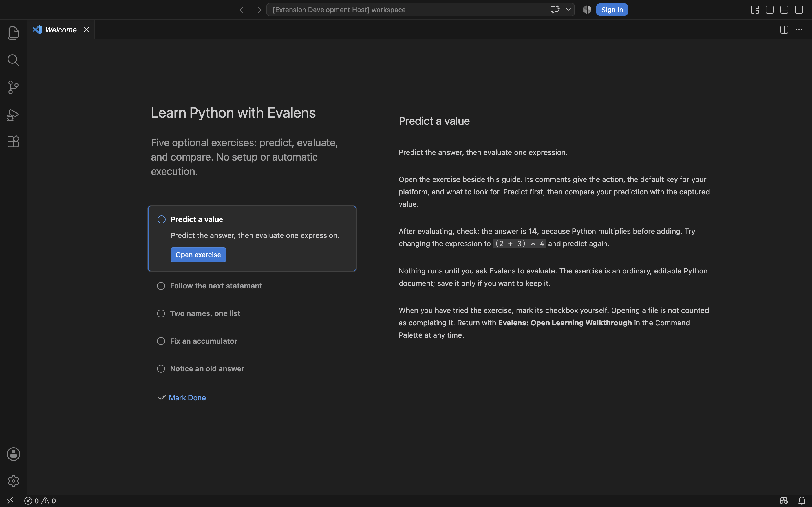
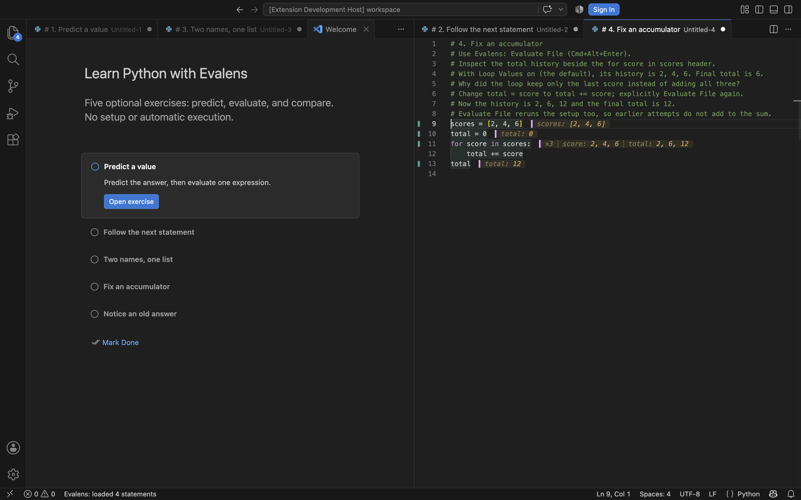

# Learning walkthrough live verification

Checked on 2026-09-06 against implementation commit `a14d438`, in a real
VS Code Extension Development Host on macOS with the dark theme. The
integrating session drove extension commands and document edits through a
local bridge, queried real hover results, and captured the editor using
browser automation. Both retained screenshots were visually reviewed.

The guide opened through **Evalens: Open Learning Walkthrough**. All five
exercises opened as untitled Python documents with editable code, expanded
macOS key labels, and the cursor on the first statement. Before explicitly
evaluating, their initial source positions had no evaluation hover.

The live run exercised Evaluate at Cursor, Evaluate and Advance, and Evaluate
File, confirming prediction **14**, stepped total **24**, alias result
**[1, 2, 3, 4]**, and corrected accumulator **12**. Editing the stale exercise
from `answer = 10` to `answer = 20` produced a stale hover; explicit evaluation
then produced **20** and cleared staleness.

The accumulator screenshot shows the corrected `+=` statement, captured
`total: 2, 6, 12` history beside the loop header, and final `total: 12`.
Repeated exercise openings left two editor groups. Opening and evaluating
the first exercise did not mark it complete; clicking its native checkbox
changed its accessible label from Not completed to Completed.

The implementation's automated suites passed **821 extension tests** (813
before the change) and **674 kernel tests** (unchanged). Real kernel tests
also assert the broken accumulator history `2, 4, 6` and corrected history
`2, 6, 12`. The packaging test uses `vsce ls` to verify all instruction and
example assets ship.

Limits: this was agent-operated UI verification, not a beginner usability
study or human acceptance sign-off. Commands were invoked through the bridge,
so physical keyboard shortcuts were not tested. Only macOS and the captured
dark theme were checked live. This record does not claim a fresh installed
VSIX was tested; installed-extension and other-platform checks remain
separate. The test's local bridge, user profile, and full session data are
intentionally not included in the repository.
