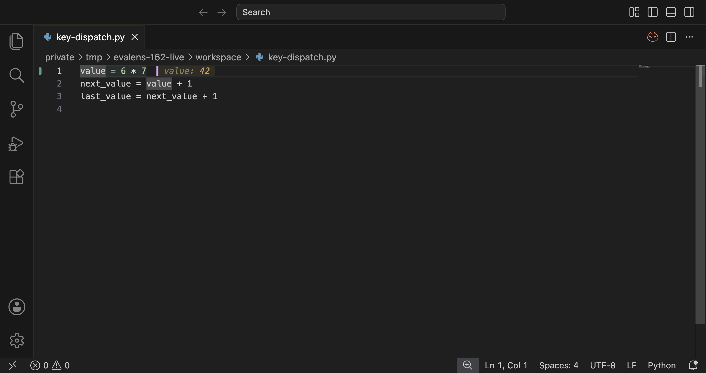
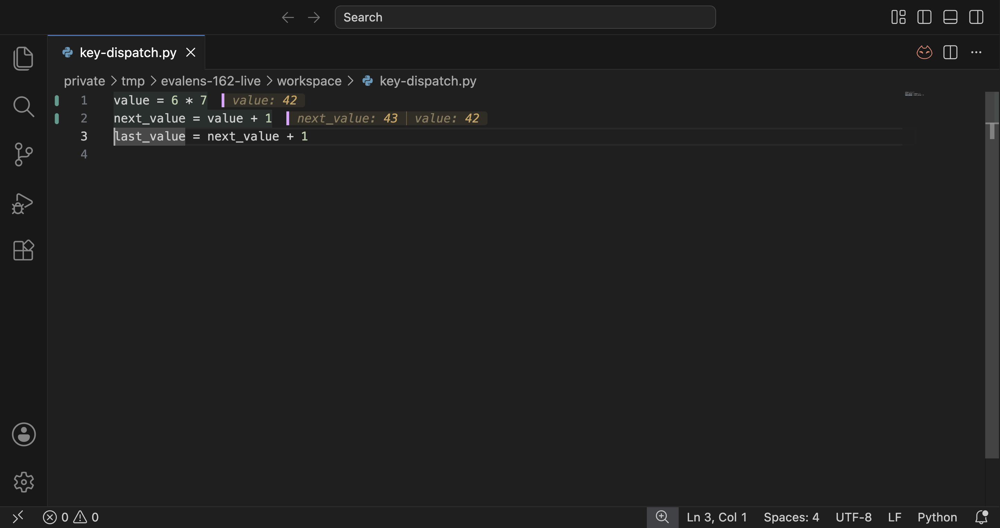

# Cmd+Enter in an installed extension

Verified 2026-09-07 in VS Code 1.136.1 on macOS arm64, against the installed
Evalens 0.0.1 build from `2e7f975`. The copied installed `extension.js` and
`keybindings.js` matched this branch's compiled files byte for byte. AREPL
3.0.0 was also installed and enabled in the test window.

## Defect and repair

The existing user bindings for `cmd+enter` and `alt+enter` both required
`isDevelopment`. That condition is false in an ordinary window. The comments
also incorrectly said that Evalens had never been installed normally.

The repair removed only `&& isDevelopment` from those two Evalens entries
and replaced the obsolete explanation. The original file was backed up
beside it as `keybindings.json.evalens-162-backup-20260907`. No removal entries
or advance binding were added, and no other user settings were changed.
This is a local configuration repair: the extension's manifest, commands,
evaluation resolution, and trigger semantics already had the correct behavior.

## Real key dispatch

An isolated ordinary VS Code window used its own user-data and extensions
directories under `/private/tmp/evalens-162-live`. There was no
`--extensionDevelopmentPath` or `--extensionTestsPath`, so this did not gain
the context that had concealed the failure. A small installed test helper
opened the fixture and read cursor and hover state through the VS Code API.
Puppeteer sent actual key events through Chromium's debugger protocol;
the evaluation commands were not called through `executeCommand`.

The only evaluated file was this agent-owned fixture:

```python
value = 6 * 7
next_value = value + 1
last_value = next_value + 1
```

With the original user keybindings copied into the isolated profile,
`Cmd+Enter` matched AREPL's `extension.executeAREPLBlock`, produced no Evalens
hover, and left the cursor on line 1. With the repaired file copied in,
VS Code picked up the change without a reload:

| Key | Matched command | Result | Cursor after |
|---|---|---|---|
| Cmd+Enter on line 1 | `evalens.evaluateAtCursor`, user binding | `value: 42` | Line 1 |
| Cmd+Shift+Enter on line 1 | `evalens.evaluateAndAdvance`, extension binding | `value: 42` | Line 2 |
| Cmd+Shift+Enter on line 2 | `evalens.evaluateAndAdvance`, extension binding | `next_value: 43` | Line 3 |
| Alt+Enter on line 3 | `evalens.evaluateAtCursor`, user binding | `last_value: 44` | Line 3 |

[The keybinding service's dispatch log](key-dispatch.log) records the
before/after matches and invocations. Its duplicate match lines are the
service's soft dispatch followed by dispatch; there is one invocation per
keypress.

The checks were repeated with the Output panel hidden for these screenshots.
The status bar shows the cursor remaining on line 1 after evaluation and
moving to line 3 after evaluating line 2 with advance.





## Automated checks and limits

Both suites passed: 839 extension tests and 678 kernel tests, unchanged from
the baseline. No test was added to assert a documentation phrase or to pretend
that a mocked command invocation proves keyboard dispatch.

This verifies the installed-extension route and VS Code's actual keybinding
resolver with AREPL present. It does not verify a physical keyboard, operating
system shortcut interception, other profiles, or the maintainer's currently
open editor window. The maintainer's original keybindings file was repaired;
their Python teaching files were neither modified nor evaluated.
