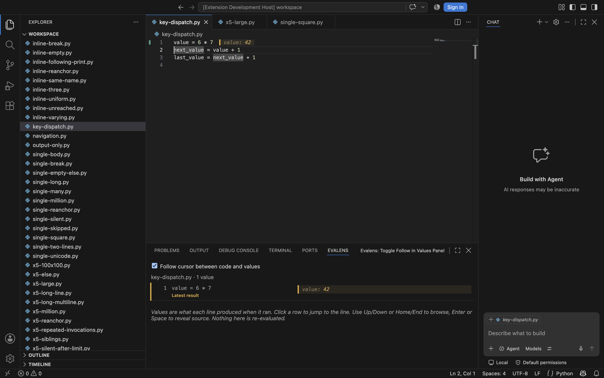
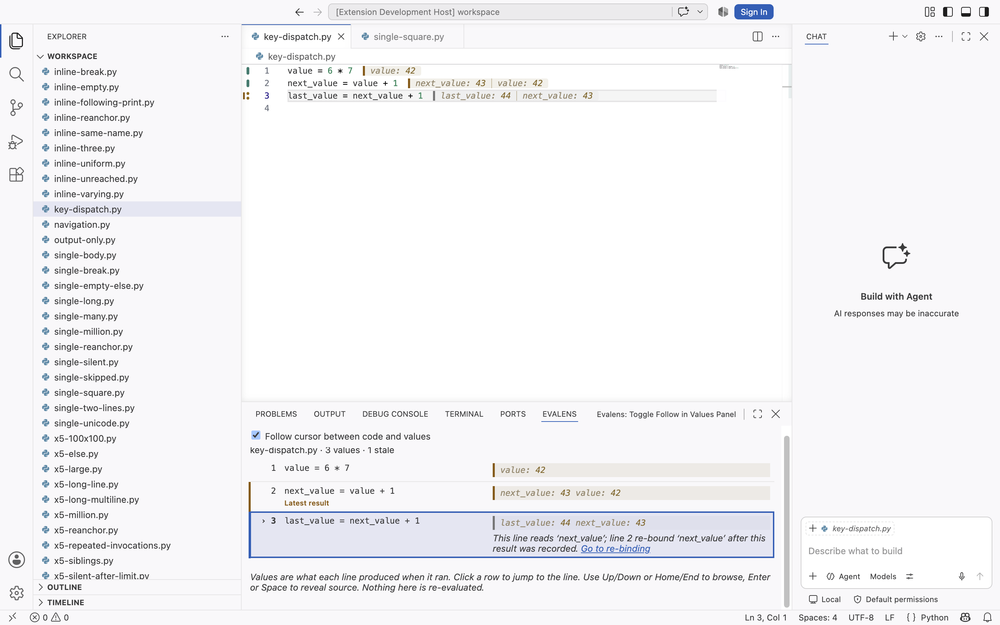

# Latest completed result in Values

Evaluate and Advance moves the source cursor before its result arrives. The
Values panel now gives the most recently recorded result in each document
its own amber edge and **Latest result** label. The current source row still
has its own navigation cue and `aria-current` state. An unevaluated next line
therefore leaves the completed result identifiable without claiming that the
cursor stayed behind.

The label follows a registry-assigned result identity through source shifts
and stale marking. Edits, fold changes, pending updates, and cursor movement
do not create identities. A replacement pending mark removes the old result
and its cue; a pending mark elsewhere leaves the last result identified.
Errors count as completed results. Closing or clearing a document removes its
identity, and an inactive document's completion cannot mark another file.
The provider keeps one weakly keyed identity per live document, not captured
payloads or a completion history.

Neither follow setting changes meaning. Painting the cue adds no navigation,
scrolling, focus transfer, kernel request, or source-code execution. Existing
square amber result bars and the transparent loop-explorer background remain.

## Automated verification

Original baseline: 877 extension tests and 708 kernel tests. This change
adds eight extension tests and passed 885/708 before rebasing. Rebased onto
navigation centering and the quieter source marker, the combined branch
passes 902 extension tests and 708 kernel tests (894 extension tests before
this change). The eight new cases in
`src/test/panelLatestResult.test.ts` drive the compiled extension and real
Python subprocess through the fake VS Code shell. They cover:

- Evaluate and Advance, repeated/out-of-order evaluation, and a cursor on an
  already evaluated next statement.
- Both another statement running and replacement of the latest result by a
  pending mark, followed by actual completion.
- Prefix insertion, own-source staleness, deletion, row-number reuse, and
  clearing all results.
- Both follow settings disabled, hidden view evaluation, disposal/recreation,
  and cursor movement to an unmatched line.
- A completion arriving for an inactive document, switching back, closing,
  and reopening its URI as a different document.
- Long-loop iteration and output paging/folding after the source cursor has
  advanced, plus errors and dependency staleness.

The shipped-script navigation test additionally verifies that unmatched
cursor messages preserve the separate latest-result class. The original
82 focused panel tests also passed before the rebase; the combined full
suite includes their updated navigation checks. Source-marker geometry,
actual keyboard dispatch, and theme appearance were checked separately in
the root session's Extension Development Host, as recorded below.

## Extension Development Host acceptance

The root session ran the combined build with navigation centering, the
quieter source marker, and this change, using only the fixtures retained in
this directory. Actual keyboard dispatch and the rendered webview passed:

- Shift-Cmd-Enter recorded `42` and advanced the source cursor while leaving
  the completed row labelled **Latest result**. The next step recorded `43`
  and moved the cue to that result.
- Cmd-Enter recorded `44` without moving the cursor, combining the current
  and latest cues on the same row.
- Advancing onto an already evaluated next statement kept its current-row
  marker separate from the latest result; `aria-current` stayed accurate.
- Unmatched cursor movement, disabling both follow settings, switching
  files, and hiding/reopening the view preserved the correct result cue.
- Loop folding/rebuilding preserved the cue, transparent result surface,
  and square result corners. Clearing results removed the cue.
- Computed amber marker colours matched all four themes: Dark Modern,
  Light Modern, Default High Contrast, and Default High Contrast Light.

The root session visually inspected the dark and light appearances. The
high-contrast themes have automated computed-colour verification; visual
inspection of their screenshots is not claimed here. Pending transitions,
edits, and inactive-document completion also have the real-kernel automated
coverage described above.

The exact [Host script](harness/verify-173.cjs), its
[client](harness/client.cjs), and [results](host-results.json) are retained.
The script expects the root session's temporary fixture workspace at
`/private/tmp/evalens-learning-live/workspace`, with the existing bridge on
port 9355 and VS Code's debugging connection on port 9354. The
[bridge](../165-inline-nested-histories/harness/bridge.cjs) is retained with
the earlier inline-history review. It must only be replayed
against these own fixtures, never a user's teaching files.

