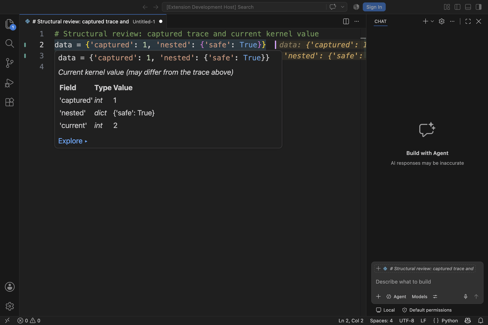

# Evalens structural review — 2026-09-06

## Outcome

14 actionable findings: 8 high-priority and 6 medium-priority. Each has an open
GitHub issue, a fix committed in its own SOP-named worktree, regression coverage,
and a published PR. Nothing from this review was merged into master. No issue
was closed, no worktree was removed, and no force-push or hook bypass was used.

The original review covered `0e128e8`. Other sessions subsequently merged
README changes and the values panel (#116). The complete review stack now
incorporates that integration base, `fdc4fb2`, with conflicts resolved in the
relevant issue worktrees. The reconciled implementation tip is `722f053`;
this report and its screenshot are a documentation-only follow-up.

## Findings

Priority reflects user-visible correctness, reliability, unintended execution,
or sensitive-data handling; it is not a CVSS security rating.

| Issue | Priority | Finding | Resolution | PR |
| :--- | :--- | :--- | :--- | :--- |
| [#119](https://github.com/mbjarland/evalens/issues/119) | High | Retired process callbacks could corrupt a replacement session. | Guard callbacks and delayed requests by process identity and generation; retire failed pipes. | [#135](https://github.com/mbjarland/evalens/pull/135) |
| [#120](https://github.com/mbjarland/evalens/issues/120) | High | Concurrent commands could interleave resets, evaluations, and input context. | Serialize complete evaluation transactions; bind prompts to their request; cancel queued work on restart. | [#136](https://github.com/mbjarland/evalens/pull/136) |
| [#121](https://github.com/mbjarland/evalens/issues/121) | High | Late results could repaint edited, cleared, or closed documents. | Gate painting on document version and annotation generation; retire pending handles and stale outlines. | [#137](https://github.com/mbjarland/evalens/pull/137) |
| [#122](https://github.com/mbjarland/evalens/issues/122) | High | Isolated statement compilation inherited the kernel’s future settings instead of the source file’s. | Derive explicit future flags from the source module and compile with `dont_inherit=True`. | [#138](https://github.com/mbjarland/evalens/pull/138) |
| [#123](https://github.com/mbjarland/evalens/issues/123) | High | Python UTF-8 AST columns were treated as VS Code UTF-16 positions. | Translate cursor, result, outline, watch, and syntax-error coordinates at the boundary. | [#139](https://github.com/mbjarland/evalens/pull/139) |
| [#124](https://github.com/mbjarland/evalens/issues/124) | Medium | Whitespace normalization hid meaningful indentation and multiline-string edits. | Preserve exact source whitespace, normalizing only CRLF line endings. | [#140](https://github.com/mbjarland/evalens/pull/140) |
| [#125](https://github.com/mbjarland/evalens/issues/125) | High | Passive inspection could invoke custom repr, getters, traversal, and metaclass hooks. | Use static type metadata, native storage operations, and a bounded passive formatter. | [#141](https://github.com/mbjarland/evalens/pull/141) |
| [#126](https://github.com/mbjarland/evalens/issues/126) | Medium | Hover inspection could wait behind execution, mix current and historical values, and render value text as active Markdown. | Use idle-only, coalesced reads with a 100 ms deadline and cancellation; label current values and escape literal text. | [#142](https://github.com/mbjarland/evalens/pull/142) |
| [#127](https://github.com/mbjarland/evalens/issues/127) | Medium | Wide tables formatted every column before truncating; subclass traversal could run user methods. | Select a bounded column sample before formatting and use native container reads. | [#143](https://github.com/mbjarland/evalens/pull/143) |
| [#128](https://github.com/mbjarland/evalens/issues/128) | High | Password answers entered replay history and input annotations. | Never cache or log password reads; preserve ordinary input replay around password positions. | [#144](https://github.com/mbjarland/evalens/pull/144) |
| [#129](https://github.com/mbjarland/evalens/issues/129) | Medium | Sized stdin reads ignored their size and discarded unread characters. | Buffer the remainder, honor zero/sized reads, and retain EOF within the statement’s input stream. | [#145](https://github.com/mbjarland/evalens/pull/145) |
| [#130](https://github.com/mbjarland/evalens/issues/130) | Medium | Interpreter failures produced duplicate notifications, sometimes retried within one keypress. | Use an already-reported error type; retain actionable buttons; short-circuit explicit interpreter configuration. | [#146](https://github.com/mbjarland/evalens/pull/146) |
| [#131](https://github.com/mbjarland/evalens/issues/131) | High | Statement stdout/stderr capture grew without bound and prompt lookup scanned the full transcript. | Retain 65,536 characters per stream plus an omission count; keep a separate bounded prompt tail and full live streaming. | [#147](https://github.com/mbjarland/evalens/pull/147) |
| [#132](https://github.com/mbjarland/evalens/issues/132) | Medium | The commit gate could not parse under macOS’s bundled Bash. | Repair the case-pattern syntax and execute staged clean/conflict scenarios in tests. | [#134](https://github.com/mbjarland/evalens/pull/134) |

The recurring structural weakness was ownership across asynchronous boundaries:
which process, user command, document version, or point in time a result belongs
to. The fixes make those boundaries explicit. A second theme was doing expensive
or user-defined work before applying a display limit; the new inspection,
table-sampling, and output-capture paths apply limits before building results.

## Scope and historical decisions

The review traced command registration and execution, kernel startup/restart and
both protocol channels, AST resolution and compilation, annotation lifecycle,
hover/explorer behavior, stdin/replay, representation budgets, interpreter
configuration, packaging, tests, and commit hooks. Findings were checked against
existing issue history before being filed; they are actionable defects rather
than speculative style changes.

Relevant prior decisions were retained:

- [#23](https://github.com/mbjarland/evalens/issues/23): live inspection may
  re-resolve current storage, but must be labelled, silent, and not queued
  behind execution. No retained-object cache was introduced.
- [#39](https://github.com/mbjarland/evalens/issues/39): interpreter failure has
  one actionable notification. An existing test expecting two was corrected.
- [#54](https://github.com/mbjarland/evalens/issues/54): representation work
  must be bounded before materialization; this review extends that principle
  to tables and captured output.
- [#80](https://github.com/mbjarland/evalens/issues/80): pickle/spawn support
  was intentionally declined. This review does not add synthetic module
  registration or claim disk-based multiprocessing reflects an unsaved buffer.

The Unicode boundary follows Python’s
[UTF-8 AST offset contract](https://docs.python.org/3/library/ast.html).
Compilation uses the documented
[explicit flags and inheritance controls](https://docs.python.org/3/library/functions.html#compile).
The absent Workspace Trust capability was not misreported as execution in
Restricted Mode: VS Code’s
[default disables unsupported extensions there](https://code.visualstudio.com/api/extension-guides/workspace-trust).

## Verification

- Initial baseline: 689 TypeScript tests and 650 Python tests.
- Complete fixes before concurrent integration: 724 TypeScript tests.
- Reconciled stack: **757 TypeScript tests pass**, including the new values
  panel, command-to-real-kernel integration, and regression tests.
- **674 Python tests pass on each of 3.9, 3.11, 3.13, and 3.14 on macOS.**
  After integration the full kernel suite was rerun; the concurrent changes
  did not alter kernel code.
- Conflict-resolution checkpoints: 81 extension/panel tests at #121;
  130 registry/extension/panel tests at #124.
- New regression coverage includes retired-process events, queued input,
  edit/clear/close during held input across four command types, future flags,
  accented/CJK/emoji coordinates, semantic whitespace, hostile Python hooks,
  hover deadlines/cancellation, 10,000-column tables, password replay holes,
  sized reads, interpreter failures across six entry points, and capped
  output with complete live streaming.
- The VSIX packages successfully from the clean reconciled implementation
  commit. Its contents include `kernel/passive.py`, `kernel/capture.py`,
  and compiled hover helpers; tests and host-profile scratch files are excluded.
- GitHub Actions checks each PR’s issue references, extension build/tests, and
  Linux kernel suite on Python 3.9, 3.11, and 3.13. The linked PR checks are
  the authoritative live status. All five checks passed on each of the 14
  reconciled implementation heads (70 successful checks).

### Real editor check

A separate VS Code **1.136.1** Extension Development Host used an isolated
profile and a synthetic untitled Python buffer. The buffer was evaluated,
mutated, and hovered through the real VS Code command/provider APIs. The hover
shows the earlier trace separately from the labelled current children, and
the nested value renders literally. The screenshot was visually inspected,
not inferred from a mock. It records the complete fixes at `c992615`; the
real-host provider assertions were repeated successfully after integration
at `722f053`.



The bulk of editor regression coverage still uses a fake VS Code API with a
real Python subprocess. Those tests prove lifecycle and protocol behavior,
not pixels. This was not a Windows desktop run, a screen-reader audit, or a
complete theme/zoom matrix.

## Merge handoff

Every worktree lives under `/Users/mbjarland/projects/evalens-worktrees/`,
with the same name as its branch. Keep the stack order:

`132 → 119 → 120 → 121 → 122 → 123 → 124 → 125 → 126 → 127 → 128 → 129 → 130 → 131`

| Issue | Branch / worktree name | PR base | Original fix commit | PR |
| :--- | :--- | :--- | :--- | :--- |
| #132 | `132-macos-commit-hook` | `master` | `2f0f6ee` | [#134](https://github.com/mbjarland/evalens/pull/134) |
| #119 | `119-retired-kernel-events` | `132-macos-commit-hook` | `5afc7b1` | [#135](https://github.com/mbjarland/evalens/pull/135) |
| #120 | `120-evaluation-request-order` | `119-retired-kernel-events` | `1312c7d` | [#136](https://github.com/mbjarland/evalens/pull/136) |
| #121 | `121-late-evaluation-results` | `120-evaluation-request-order` | `93b2ca4` | [#137](https://github.com/mbjarland/evalens/pull/137) |
| #122 | `122-explicit-future-flags` | `121-late-evaluation-results` | `e93e60f` | [#138](https://github.com/mbjarland/evalens/pull/138) |
| #123 | `123-unicode-source-coordinates` | `122-explicit-future-flags` | `8fb57ca` | [#139](https://github.com/mbjarland/evalens/pull/139) |
| #124 | `124-semantic-whitespace-staleness` | `123-unicode-source-coordinates` | `74d7788` | [#140](https://github.com/mbjarland/evalens/pull/140) |
| #125 | `125-passive-value-inspection` | `124-semantic-whitespace-staleness` | `be04041` | [#141](https://github.com/mbjarland/evalens/pull/141) |
| #126 | `126-hover-inspection-lifecycle` | `125-passive-value-inspection` | `356af2c` | [#142](https://github.com/mbjarland/evalens/pull/142) |
| #127 | `127-bounded-tabular-formatting` | `126-hover-inspection-lifecycle` | `f95ca90` | [#143](https://github.com/mbjarland/evalens/pull/143) |
| #128 | `128-password-input-history` | `127-bounded-tabular-formatting` | `f51136f` | [#144](https://github.com/mbjarland/evalens/pull/144) |
| #129 | `129-sized-stdin-reads` | `128-password-input-history` | `98abeb8` | [#145](https://github.com/mbjarland/evalens/pull/145) |
| #130 | `130-interpreter-error-notifications` | `129-sized-stdin-reads` | `3b4bee2` | [#146](https://github.com/mbjarland/evalens/pull/146) |
| #131 | `131-bounded-output-capture` | `130-interpreter-error-notifications` | `c992615` | [#147](https://github.com/mbjarland/evalens/pull/147) |

The original fix commits remain in history. Additional merge commits propagated
the concurrent master changes forward through the stack without rewriting it.
Each PR’s base is the preceding branch, so its diff isolates that finding.

For the separate merge session, merge issue branches into master in the order
above, then retarget the next PR to master before merging it. Prefer normal
merge commits (or an intentional fast-forward workflow) for this dependent
stack. Squashing/rebasing early branches can make later PRs repeat changes whose
original commits are still ancestors. Do not merge the final PR into its
predecessor expecting that to merge anything into master.

Until #132 is merged into master, the shared installed hooks still point to
master’s old macOS-incompatible script. This session ran the repaired hooks
for every commit with:

```sh
git -c core.hooksPath=/Users/mbjarland/projects/evalens-worktrees/132-macos-commit-hook/bin/hooks commit …
```

That runs both hooks; it is not `--no-verify`. After the hook fix is merged,
the normal shared hook path works again.

All review issues remain open and marked In progress while awaiting the
maintainer’s merge. The report deliberately does not mark unmerged work Done.

## Remaining boundaries

- This is not a sandbox: explicit evaluation still runs the user’s Python.
- Password reads are excluded from *input history*. Python code that explicitly
  returns, assigns, or prints a secret can still display it as an evaluation
  result; the review does not claim otherwise.
- Passive inspection intentionally describes unsupported objects by type
  instead of executing their custom repr or accessors.
- Table consistency is checked only within the bounded sample. A wide record
  whose visible keys cannot be aligned is left as ordinary text.
- Precise alias/mutation dependency tracking and retained historical object
  snapshots were not added. Live inspection is explicitly labelled current.
- Native writes to file descriptors and disk-based multiprocessing remain the
  documented kernel boundary; these fixes improve transport recovery without
  claiming to intercept every native I/O path.
