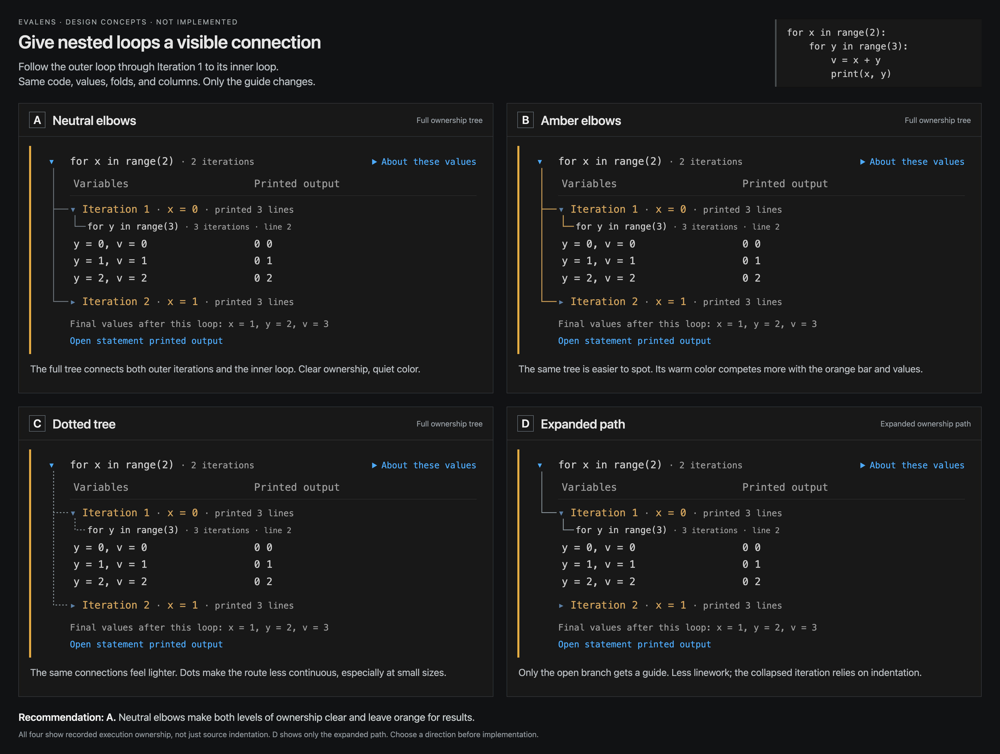

# Nested loop tree guides: concepts A–D

These are **unimplemented design concepts** for
[#203-nested-loop-tree-guides](https://github.com/mbjarland/evalens/issues/203).
They compare guide treatments before a user choice or runtime change.

[Open the comparison](comparison.html) · [View the image](comparison.png)



## Recommendation and choices

**Recommend A: neutral elbows.** It makes both ownership levels explicit,
including the collapsed sibling, while leaving orange for result emphasis.
The recommendation is advisory; the user's choice is still pending.

| Option | Connection | Tradeoff |
| --- | --- | --- |
| A: Neutral elbows | Root loop to both outer iterations; expanded iteration to its inner loop | Continuous, visible structure with restrained color; a long rail remains beside the values. |
| B: Amber elbows | The same full tree | Stronger emphasis, but it competes with the result bar and gold iteration headings. |
| C: Dotted tree | The same full tree | A lighter texture, but the path is less continuous and may become harder to follow at smaller sizes. |
| D: Expanded path | Root loop through the expanded iteration to its inner loop | Less linework; the collapsed sibling's ownership still depends on indentation. |

The connections describe **recorded execution ownership**. The inner loop
shown here belongs to Iteration 1, where `x = 0`. Another instance belongs
inside Iteration 2. This is more specific than connecting the two `for`
statements in a static picture of their source code.

A–C expose the shared parent of both iterations. D exposes only the open
path. None adds connectors to the individual `y` values, repeats the column
headings, or restores the removed timing/context rows.

## Common content and layout

All four use the same code, actual recorded data, fold state, and geometry:

```python
for x in range(2):
    for y in range(3):
        v = x + y
        print(x, y)
```

Iteration 1 is expanded; Iteration 2 is collapsed. The visible variable
readings are `y = 0, v = 0`, `y = 1, v = 1`, and `y = 2, v = 2`. Their
printed output is `0 0`, `0 1`, and `0 2`. The final values after the entire
loop are `x = 1, y = 2, v = 3`; that footer includes the collapsed second
iteration's execution.

The comparison preserves the square orange result bar, neutral loop
background, warm iteration headings, blue disclosure triangles, one shared
`Variables` / `Printed output` header, and one `About these values` control.
Every option reserves the same extra left gutter for the proposed guide.
The inner source header receives the same additional indentation in all
four. Variable and output columns keep their shared alignment.

These layouts do not replace the actual public screenshot at
[media/demo/nested-loops.png](../../../media/demo/nested-loops.png).
The comparison page's outer frame and labels are presentation material,
not proposed extension chrome. Fold/export controls show a fixed state;
they do not connect to VS Code. The native HTML help disclosure can open.

## How the image was produced

`render.cjs` runs the existing
[nested-loop fixture](../196-marketplace-page-refresh/fixtures/nested-loops.py)
once through the real Python kernel. It passes that response through the
compiled production `present`, `rowsFor`, and `loopExplorerHtml` functions.
`LOOP_EXPLORER_STYLE` supplies the actual loop styling. `template.html` adds
a common comparison frame, the uniform guide gutter, and measured SVG paths.
Headless Chrome captures the resulting standalone `comparison.html` directly.
No existing screenshot pixels were edited or used as a background.

The capture was produced from baseline `30cd293`, using the main checkout's
compiled modules and dependencies. The helper verifies that its relevant
runtime source files match the issue worktree before rendering.

To reproduce from a checkout with dependencies and compiled output:

```sh
npm --cache /private/tmp/evalens-npm-cache ci
npm --cache /private/tmp/evalens-npm-cache run compile
node docs/reviews/203-nested-loop-tree-guides/render.cjs
```

An issue worktree can reuse a matching built checkout by setting
`EVALENS_RUNTIME_ROOT` to that checkout's absolute path. An alternate Chrome
binary can be supplied with `EVALENS_CHROME_PATH`.

## Verification and limits

[checks.json](checks.json) records the source hash, image hash/dimensions,
and measured comparison geometry. The capture is 3920 × 2956 pixels at
device scale factor 2.

The helper verified all four variants have the same source, values, output,
final snapshot, dimensions, and aligned columns. Each has one column header
and one help disclosure, no repeated visible timing labels, an expanded
first iteration, and a collapsed second iteration. It checked the expected
three guide paths for A–C and two paths for D. Chrome reported no script
errors. The complete image was also inspected visually.

This lane changed only files in this review directory. Product test suites
were not rerun because runtime code is unchanged; the root integration
session owns the normal repository checks. No native VS Code session was
opened or controlled. This is not native acceptance evidence, a learner
study, or a screen-reader review.

Before implementing a chosen guide, verify deeper nesting, sibling loops,
folding and paging, scrolling context, narrow panels, large fonts, and light
and high-contrast themes. A guide must preserve ownership when visible
content changes; adding repeated explanatory rows is not part of this
proposal. No option has been selected for implementation.
