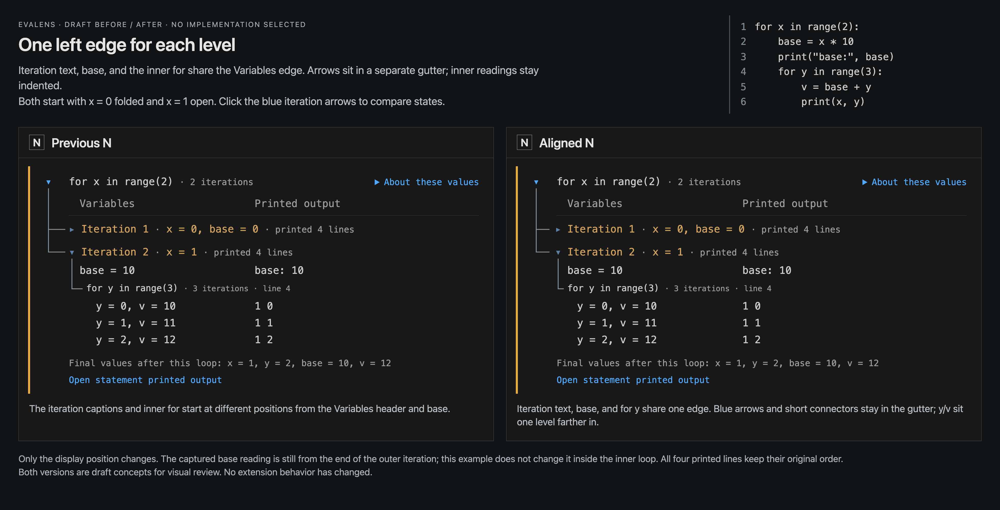

# Approved nested-loop layout: Aligned N

The maintainer chose the **right-hand Aligned N** in
[the final comparison image](n-alignment-comparison.png) and
[interactive comparison](n-alignment-comparison.html).
[The recorded approval](https://github.com/mbjarland/evalens/issues/203#issuecomment-5602378580)
settles the design decision in #203. Runtime implementation is
[#205](https://github.com/mbjarland/evalens/issues/205); refreshed public
screenshots and copy are [#206](https://github.com/mbjarland/evalens/issues/206).



The comparison is preserved exactly as reviewed, including its draft
labels. This README records the final choice. These are design artifacts;
they do not establish that the extension already implements the layout.

## Chosen geometry

- Variables, the text of both Iteration captions, expanded outer-body
  values such as `base = 10`, and the inner `for y` header share one left
  edge. Disclosure triangles occupy a separate gutter to their left.
- Inner y/v readings indent one level below that edge: 19px in the
  reviewed 20px-font example. Printed output and every printed reading
  share a separate fixed left edge, including output before the inner loop.
- The neutral root guide connects the iteration captions. An expanded
  iteration's short child guide ends before its inner `for` header.
  No line continues alongside the values. A sole inner loop gains no
  additional fold control.
- Keep one Variables / Printed output heading pair, one About these
  values disclosure, the square orange result bar, neutral background,
  warm iteration captions, and blue fold triangles.

The approved comparison measured 0px difference for every shared text
edge at widths 1960, 1300, and 980px. Inner readings were +19px, arrow
glyphs ended about 12px before labels, and the child connector ended 7px
before source text. These measurements describe the reviewed prototype;
runtime checks must preserve the hierarchy at other fonts and themes.

## Fold and body-value behavior

The [six-line fixture](before-inner-fixture.py) contains work before the
inner loop:

```python
for x in range(2):
    base = x * 10
    print("base:", base)
    for y in range(3):
        v = base + y
        print(x, y)
```

When Iteration 2 is expanded, its caption shows `x = 1` and the count
`printed 4 lines`. Directly below it, `base = 10` appears beside printed
`base: 10`, above `for y`. The inner rows show y values 0, 1, 2 and v
values 10, 11, 12 beside printed `1 0`, `1 1`, `1 2`.

Folding puts base back in the iteration summary and hides its body values
and output. Expanded headings do not duplicate their body readings. There
is no trailing base row or visible timing label on the new parent row.

Capture semantics remain unchanged: base is the saved end-of-outer-iteration
reading, not an assignment-time snapshot. This fixture does not change
base inside the inner loop. About these values retains the timing
explanation. Printed output keeps its recorded order and ownership.

Implementation must retain capture limits, paging, selection, source
following, and local folding without evaluation. Check deeper and sibling
loops, empty or long parent output, output after a child loop, and narrow
layouts. The populated parent row must survive stacked columns; it can no
longer use the output-only class that hides an empty Variables cell.

## Preserved comparison history

Earlier recommendations and pending-choice wording record their review
stage; they are superseded by the choice above.

| Stage | Visual evidence | Notes |
| --- | --- | --- |
| A–D: initial guides | [Image](comparison.png) · [HTML](comparison.html) | [Initial notes](initial-comparison-notes.md) |
| E–G: tree structures | [Image](loop-tree-structures.png) · [HTML](loop-tree-structures.html) | [Notes](loop-tree-structures.md) |
| H–M: different organizations | [Image](tufte-loop-explorations.png) · [HTML](tufte-loop-explorations.html) | [Notes](tufte-loop-explorations.md) |
| N–P: work before the inner loop | [Image](before-inner-comparison.png) · [HTML](before-inner-comparison.html) | [Notes](before-inner-notes.md) |
| N: visible body value, shorter guide | [Image](n-body-values-comparison.png) · [HTML](n-body-values-comparison.html) | [Notes](n-body-values-notes.md) |
| N: base before the inner loop | [Image](n-base-position-comparison.png) · [HTML](n-base-position-comparison.html) | [Notes](n-base-position-notes.md) |
| **Aligned N: approved right-hand panel** | [Image](n-alignment-comparison.png) · [HTML](n-alignment-comparison.html) | [Geometry and reproduction](n-alignment-notes.md) |

## Verification and limits

[The final geometry report](n-alignment-checks.json) records image and
fixture hashes, actual text-range measurements, both fold states, exact
value/output pairs, and stacked-layout visibility. The comparison reuses
real kernel recordings; opening its HTML does not evaluate code or connect
to VS Code.

Both suites passed before and after this decision update: 969 extension
tests and 718 kernel tests. No runtime files or public images changed in this
commit. Native rendering, theme/accessibility checks, and replacement
public captures belong to #205 and #206; this design review is not native
acceptance or a learner study.
