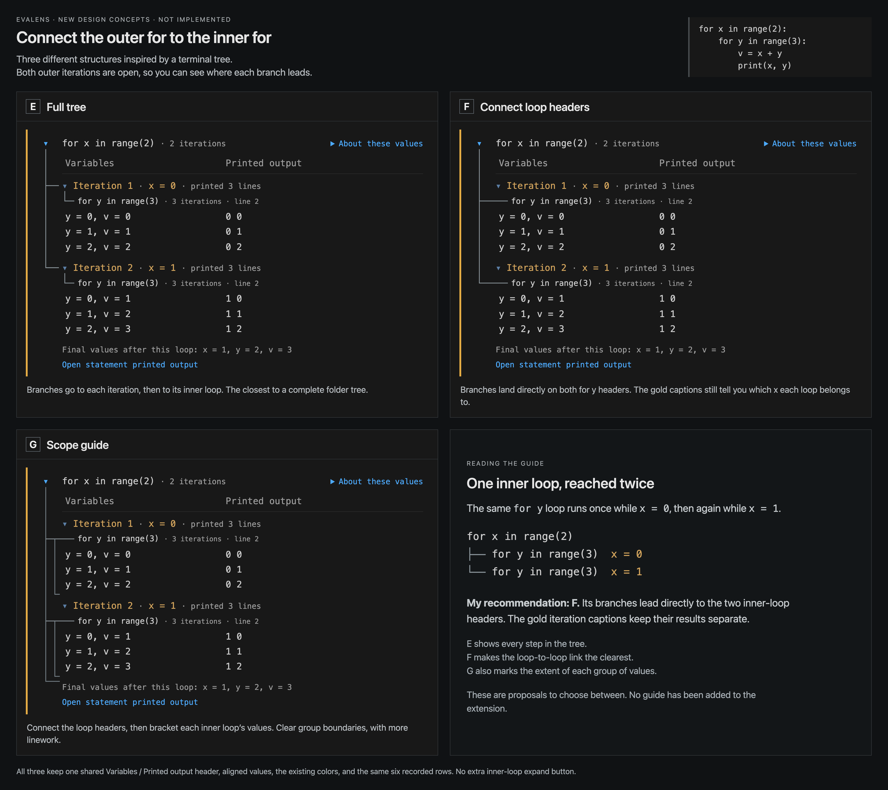

# Loop tree structures E–G

[Open the new preview](loop-tree-structures.html) ·
[View all three designs](loop-tree-structures.png)

These are **unimplemented concepts**, following the clarification in
[#203-nested-loop-tree-guides](https://github.com/mbjarland/evalens/issues/203#issuecomment-5601526024).
The requested connection should lead from the outer `for` directly toward
its inner `for` headers, in the spirit of the Linux `tree` command. The
original A–D comparison and its files remain unchanged.



Both outer iterations are expanded in every design. The continuing branch
and final elbow can therefore be compared using the same six recorded rows.

| Option | Where the branches go | Tradeoff |
| --- | --- | --- |
| E: Full tree | Outer loop → iteration → inner loop | Makes every step explicit, but the route passes through another node before reaching the inner `for`. |
| F: Connect loop headers | Outer loop → each visible inner `for` header | Makes the requested loop-to-loop link clearest. Gold iteration captions keep the two groups separate. |
| G: Scope guide | Outer loop → inner headers, with brackets beside each inner loop's values | Also shows where each group ends, at the cost of additional linework. |

**Recommend F for review.** Its first branch lands beside the first `for y`
header, and its final elbow lands beside the second. It does not invent an
extra disclosure button for either inner loop. The iteration captions still
show `x = 0` and `x = 1`; the same source loop was reached twice.

All guides stay in the left margin. They do not branch to individual
variable readings or extend into the final-values/export footer. Each design
keeps one shared `Variables` / `Printed output` header, aligned data, the
square orange result bar, the neutral background, existing colors, and one
`About these values` disclosure.

## Reproduction and verification

Run `render-structures.cjs` from this directory using the same setup as the
[original comparison](README.md#how-the-image-was-produced). It uses the same
real four-line Python fixture, one kernel evaluation, compiled production
renderer, and standalone Chrome screenshot pipeline. The new template is
`structure-template.html`; no original PNG pixels were edited.

```sh
node docs/reviews/203-nested-loop-tree-guides/render-structures.cjs
```

[structure-checks.json](structure-checks.json) records the source/image
hashes, 3920 × 3488 image dimensions, and geometry. All three designs passed
checks for both expanded iterations, the six exact variable/output pairs,
final values, shared column alignment, one header/help control, and no added
inner-loop disclosure. Both branch endpoints align with the corresponding
inner source text. Chrome reported no script errors. The complete image
was visually inspected by this lane and the root session.

Runtime and public product images are unchanged. No native VS Code session
was opened or controlled, and product suites were not rerun for these design
artifacts. This is not implementation acceptance. User choice remains
pending; scrolling, folding, deeper nesting, siblings, and narrow layouts
need review before any selected guide ships.
