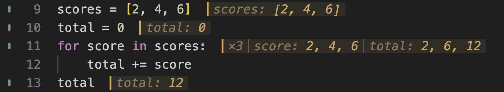

# Fix an accumulator

1. Open this exercise. Read the loop before running it: does `total = score`
   add each score to the total, or replace the total? Predict the final value.
2. Click in the Python editor and use **Evalens: Evaluate File**. This evaluates
   the setup, the loop, and the final `total` expression in order.

| Command | Windows / Linux | macOS |
| --- | --- | --- |
| Evalens: Evaluate File | Ctrl+Alt+Enter | Cmd+Alt+Enter |

These are default keys, pressed while editing Python. On a Mac keyboard,
**Alt** is **Option**. For remapped or conflicting keys, open the **Command
Palette** with **Ctrl+Shift+P** on Windows/Linux or **Cmd+Shift+P** on macOS and
search for the command name.

## Replacing the total

*Actual Evalens rendering with Loop Values enabled, the default. The history
beside the loop shows the values recorded across its iterations. Each
assignment replaced the previous total, leaving only the last score.*

Change `total = score` to `total += score`. Before evaluating again, predict
the three totals this will produce. Use **Evaluate File** again so that
`total = 0` runs before the loop.

## Adding to the total

*The first iteration adds 2 to 0; the next adds 4 to 2; the last adds 6 to 6.
The final total is 12.*

The history helps compare complete iterations. To inspect each statement
inside an iteration as it runs, use Python's debugger. Mark the walkthrough
checkbox yourself when you have tried the lesson.
