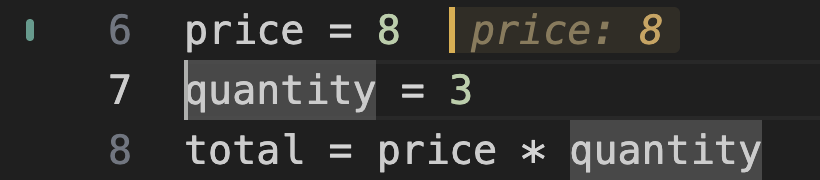
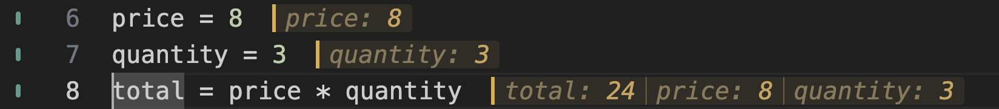

# Follow the next statement

1. Open this exercise and put the cursor on `price = 8`.
2. Predict what that statement will record. Use **Evalens: Evaluate and
   Advance** once, then look at the result and the cursor's new position.

| Command | Windows / Linux | macOS |
| --- | --- | --- |
| Evalens: Evaluate and Advance | Ctrl+Shift+Enter | Cmd+Shift+Enter |

These are default keys, pressed while editing Python. For remapped or
conflicting keys, open the **Command Palette** with **Ctrl+Shift+P** on
Windows/Linux or **Cmd+Shift+P** on macOS and search for the command name.

## After one evaluation

*Actual Evalens rendering after the first keypress. Advancing moves the cursor;
it does not evaluate the next statement for you.*

Predict what `quantity = 3` will record, then evaluate and advance once more.
Before the third keypress, predict `total = price * quantity`.

## After all three statements

*The earlier results stay beside their statements. The final assignment used
the values established by the first two.*

Try a different quantity. Evaluate its assignment and then the total again;
editing a number alone does not update Python's variables or rerun later code.
Mark the walkthrough checkbox yourself when you have tried the lesson.
