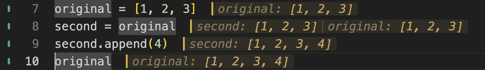

# Two names, one list

1. Open this exercise. Start on `original = [1, 2, 3]` and use **Evalens:
   Evaluate and Advance** twice to evaluate the two assignments.
2. Stop before `second.append(4)`. Predict what the last line, `original`,
   will show. Does `second = original` make another list?
3. Evaluate and advance through the remaining two statements.

| Command | Windows / Linux | macOS |
| --- | --- | --- |
| Evalens: Evaluate and Advance | Ctrl+Shift+Enter | Cmd+Shift+Enter |

These are default keys, pressed while editing Python. For remapped or
conflicting keys, open the **Command Palette** with **Ctrl+Shift+P** on
Windows/Linux or **Cmd+Shift+P** on macOS and search for the command name.

## Compare the first and last results

*Actual Evalens rendering of all four statements. Both names refer to the same
list, so appending through `second` changes the list read through `original`.*

The first line still shows `[1, 2, 3]`: that is what it recorded when it ran.
Evalens keeps that earlier result so you can see the change; it is not a live
watch of the list.

To repeat, start from `original = [1, 2, 3]` and evaluate all four statements in
order. Running only `second.append(4)` again appends another item. Mark the
walkthrough checkbox yourself when you have tried the lesson.
